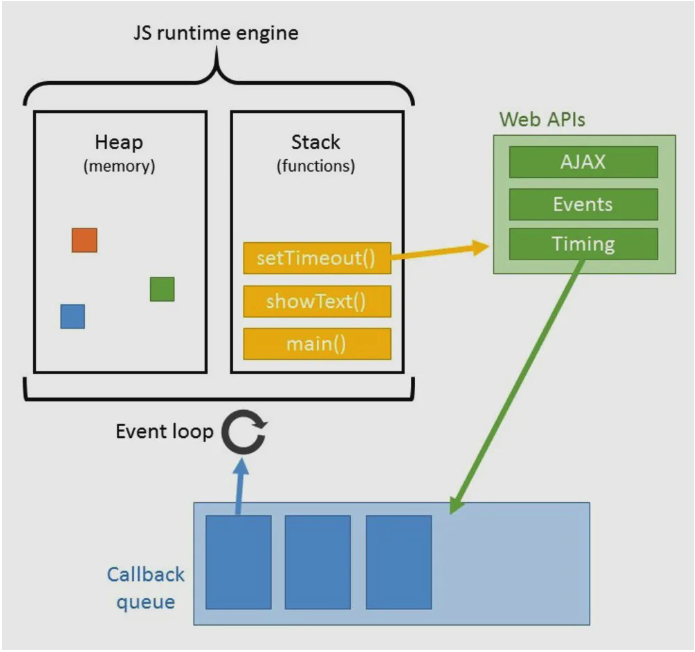

## Asynchronous JavaScript Deep Dive
> Udemy - Steven Hancock


**Introducción**

Primero que todo es necesario identificar como funciona el motor de JavaScript y como es su arquitectura:
 

- **Heap:** Hace referencia al espacio fisico en memoria usado para almacenar las variables, las funciones y los Objetos.
- **Stack:** Esta es la pila donde se almacenan las funciones y las llamadas al API (Web API in browsers and C/C++ API on local machines via NodeJs). Esta pila se comporta como una estructura last-in-first-out (LIFO).
- **API’s (Web or C/C++):** Aqui es donde se encuentran las funcionalidades reales de las funciones incorpóradas como setTimeout() y fetch().
- **Callback queue:** Algunas funciones del API requieren que se les proporcione una funcion callback para saber que hacer despues de que la funcion del API se haya ejecutado. Estas funciones callback se almacenan en esta cola(queue) y se comportan como una estructura first-in-first-out (FIFO) 
- **Event loop:** Es un algoritmo que se encuentra constantemente monitoreando el Stack. Cuando el stack se encuentra vacio, la primera funcion ubicada en el callback queue es ingresada al stack para completar su ejecucion y luego la siguiente hasta que el callback queue quede vacio.

**Funciones Declarativas:**
Las funciones declarativas usan la palabra reservada **function** al inicio para poder declarar la función, y siempre estarán disponibles en tiempo de ejecución:
```
greeting('Juanito');

function greeting(name) {
	console.log(`Hello ${name}`);
}

```
**Funciones de Expresión:**
La declaración se inicia con la palabra reservada **var**, donde se generará una variable que guardará una función anónima `Una función anonima es una función que no tiene un nombre antes del operador ()`.
```
    greeting(‘Juanito’); // ErrorType: greeting is not defined

    var greeting = function(name){
        console.log(`Hello ${name}`)
    }

    greeting(‘Juanito’); // OK..!!
```
> Las funciones expresadas solo son evaluadas cuando el flujo natural de ejecución las alcanza.

**Callback**
  Cuando una función es pasada como argumento en otra función esto se conoce como un callback:
  ```ruby
        function functionOne(num) {
            console.log(num);
        }

        function functionTwo(num, callback) {
            callbackNum = 10;
            callback(callbackNum);
            console.log(num);
        }

        functionTwo(5, functionOne); //outputs 10, then 5 on a new line
  ```
  > Esto crea un Closure donde functionOne() tiene acceso al ambito de functionTwo().

  > No se puede escribir intrinsicamente una función asincrona en JavaScript, lo que se puede hacer es usar funciones que interactuan directamente con el callback queue como la funicion setTimeout().

  - JavaScript ES6 introdujo un nuevo objeto llamado Promise, este objeto permite escribir JavaScript Asincrono.
  - Una **Promesa** es un objeto que resuelve o no un valor en el futuro, este valor es retornado a la funcion por medio de callbacks.
  `Las Promesas tiene tres estados: fulfilled, rejected, or pending`


***

1. **Understanding Asynchronous Coding**
   
   - Codigo Sincrono: Una pieza de codigo se ejecuta y debe terminar antes de ejecutar la siguiente.
   - Caracteristicas:
     - Facil de escribir y entender.
     - Puede crear codigo de bloqueo. 
     - Reduce el performance.
   - Codigo Asincrono: Una pieza de codigo no espera instrucciones diferidas y continua con su ejecución.
   - Caracteristicas:
     - Aumenta el performance
     - Elimina el codigo de bloqueo
     - Puede ser dificil de escribir y de enteder.
  > JavaScript es de un solo proceso, es decir que solo ejecuta una pieza de codigo a la vez. 
  

***

2. **The Necessity of Callbacks**
   - En JavaScript, las funciones son objetos, y se permite pasar objetos como parametro de una funcion, por lo tanto es posible pasar funciones como parametro de otras funciones y llamarlas dentro de las funciones contenedoras.
     > Una función que se pasa a otra función como parámetro es una función **callback**.
   ```ruby
   //Funcion declarativa
    let logCall = function() {
        console.log("locCall was called back.");
    };

    //Ejemplo 2
    setTimeout(logCall, 3000);

    //Ejemplo 3
    setTimeout(function() {
        console.log("The function was called back.");
    }, 3000);
  
   ```
   - Uso funcional del callback: los callbacks facilitan la implementacion de codigo asincrono, porque aseguran la ejecucion de una tarea(función) despues de que otra ha terminado.
   ```ruby
        let students = [{name:"Mary",score:90,school:"East"},
        {name:"James",score:100,school:"East"},
        {name:"Steve",score:40,school:"East"},
        {name:"Gabe",score:90,school:"West"},
        {name:"Rachel",score:85,school:"East"},
        {name:"Rochelle",score:95,school:"West"},
        {name:"Lynette",score:75,school:"East"}];

        let processStudents = function(data, callback) {
            for (let i = 0; i < data.length; i++) {
                if (data[i].school.toLowerCase() === "east") {
                    if (typeof callback === "function") {
                        callback(data[i]);
                    }
                }
            }
        }

        processStudents(students, function(obj) {
            if (obj.score > 60) {
                console.log(obj.name + " passed!");
            }
        });

        let determineTotal = function() {
            let total = 0,
                count = 0;

            processStudents(students, function(obj) {
                total = total + obj.score;
                count++;
            });

            console.log("Total Score: " + total + " - Total Count: " + count);
        }

        determineTotal();
   ```
   - Los **callback** tambien son particularmente usados para declaraciones de **eventos**, por ejemplo cuando el usuario hace click en un botón:
      ```ruby        
            let btn = document.querySelector("#item1");

            btn.addEventListener("click", function(e) {
                console.log("The button was clicked.");
            });
      ```
      > El receptor de eventos `addEventListener`, recibe dos parametos el primero determina el tipo de evento y el segundo es una función **callback**.
   - **Problemas con Callbacks:**
     - Callback Hell, esta condición resulta de anidar funciones intentando que la ejecución se lleve acabo de arriba abajo y sin un control de preciso de los errores.
     - Dificil de seguir y razonar.
     - Inversion of Control, es un termino relacionado con el flujo de control(ejecución de sentencias/instrucciones) del programa, y se presenta al usar codigo asincrono que implementa callbacks porque el flujo de control reulta externo al codigo.

***

3. **Promises**
    > Las **promesas** son la solución particular a los problemas relacionados con el uso de **callbacks**.
    - Que son las Promesas en JS:
       - Un Objeto con propiedades y metodos.
       - Representa una eventual conclusion o falla de una operación Asincrona.
       - Siempre retorna un valor.
    - Creando una Promesa:
    ```ruby
            let asyncFunction = function() {
            return new Promise(function(resolve, reject) {
                setTimeout(function() {
                    resolve("asyncFunction has resolved.");
                }, 4000);
            });
          };
    ```
    > Una promesa es un objeto devuelto al cuál se adjuntan funciones callback, en lugar de pasar callbacks a una función.
    - Usando Promesas:
    ```ruby
            let promise = asyncFunction();

            promise.then(functino(val){
                console.log('This is the value: ' + val);
            });
            // This is the value: asyncFunction has resolved.
    ```
    - Una de las grandes ventajas de usar promises es el encadenamiento:
      - El encadenamiento es usar dos o más operaciones asincronas seguidas, donde cada operación inica cuando la anterior a terminado con exito.
       ```ruby

         let asyncFunction2 = function() {
            return new Promise(function(resolve, reject) {
                setTimeout(function() {
                    resolve("asyncFunction2 has resolved.");
                }, 3000);
            });
          };

        asyncFunction()
        .then(function(val){
             console.log('AsyncFuntion: ' + val);
             return asyncFunction2();
        })
        .then(function(val){
            console.log('AsyncFuntion2: ' + val);
        })

        //--------------------
        // usando funciones de flecha
        //--------------------

        asyncFunction()
        .then(val => {
             console.log('AsyncFuntion: ' + val);
             return asyncFunction2();
        })
        .then(val => console.log('AsyncFuntion2: ' + val));
       ``` 
    - **catch( ) metodo:** Las promesas resuelven capturando  todos los errores, incluso excepciones lanzadas y errores de programación. `Esto es esencial para la composición funcional de operaciones asíncronas.`
        ```ruby
            let wordnikWords = "http://api.wordnik.com/v4/words.json/",
                wordnikWord = "http://api.wordnik.com/v4/word.json/",
                apiKey = "?api_key=xxxxxxxxxxxxxxxxxxxxxxxxxxxxxxxxxx",
                wordObj={};

            fetch(wordnikWords + "randomWord" + apiKey)
            .then(function(response) {
                wordObj = response;
                //console.log(wordObj);
                return response.json();
            })
            .then(function(data) {
                console.log(data.word);
                return fetch(wordnikWord + data.word + "/definitions" + apiKey);
            })
            .then(function(def) {
                //console.log(def);
                return def.json();
            })
            .then(function(def) {
                console.log(def);
            })
            .catch(function(err) { // captura de errores
                console.log(err);
            });

        ```
        - El error retornado por una promesa tambien se puede capturar pasando un segundo callback en el metodo then():
         ```ruby
          let promise = new Promise(function(resolve, reject) {
                setTimeout(function() {
                    reject("Error");
                }, 4000)
            });

            promise.then(function(val) {
                console.log(val);
            }, function(val) {
                console.log("rejected: " + val);
            });
         ``` 
- **finally( ) metodo:**
   - Este metodo puede ser de utilidad si es necesario hacer algún proceso o limpieza una vez que la promesa termina, sin importar su resultado.
   - El metodo finally( ) no recibe ningun argumento.
    ```ruby
        asyncFunction2()
        .then(msg => console.log(msg))
        .catch(err => console.log(err))
        .finally(() => console.log("Cleaning up tasks."));
    ```

  > Asynchonous Commands:
   >- setTimeout()
   >- setInterval()
   >- Node.js: setImmediate()
   >- Node.js: process.nextTick()
   >- Node.js: readFile()
- **Usando metodos estaticos .all y .race de las Promesas**
   - Estos metodos estaticos estan en el constructor del Objeto Promise y para acceder a las funcionalidades se usa: `Promise.all() ` y ` Promise.race()` .
     ```ruby
            let firstFunction = function() {
            return new Promise(function(resolve, reject) {
                setTimeout(function() {
                    resolve("Function1");
                }, 1000);
            });
            };

            let secondFunction = function() {
                return new Promise(function(resolve, reject) {
                    setTimeout(function() {
                        resolve("Function2");
                    }, 3000);
                });
            };

            let thirdFunction = function() {
                return new Promise(function(resolve, reject) {
                    setTimeout(function() {
                        resolve("Function3");
                    }, 5000);
                });
            };

            //----------------
            // Promise.all()
            //----------------
            Promise.all([firstFunction(), secondFunction(), thirdFunction()])
                .then(function(result) {                    
                    console.log(result[0] + " " + result[2] + " " + result[1]);
                })
                .catch(function(result) {
                    console.log(result);
                });

            //----------------
            // Promise.race()
            //----------------
            Promise.race([firstFunction(), secondFunction(), thirdFunction()])
                .then(function(result) {
                    console.log(result);
                })
                .catch(function(result) {
                    console.log(result);
                });

     ```
   > Promise.all( ) y Promise.race( ) son dos herramientas de composición para ejecutar operaciones asíncronas en paralelo.
***

4. **Async Await**
   > Las promesas simplificaron el uso de callback, Async Await simplifica el uso de Promesas.

   - La declaración de función async define una función asíncrona, la cual devuelve un objeto AsyncFunction.
   - Las funciones Async permiten que las promesas resuelvan de una manera sincrona  y sin bloqueo en el proceso. `las funciones asyn pueden ser de expresion o declarativas`
   - Una función async puede contener una expresión await, la cual pausa la ejecución de la función asíncrona y espera la resolución de la Promise pasada.
   - Cuando se llama a una función async, esta devuelve un elemento Promise. 
    ```ruby
            const swapiFilms = async function() {
            let url = "https://swapi.dev/api/films/",
                filmsData = {},
                films = [];

            filmsData = await fetch(url).then(data => data.json());

            //processing data
            films = filmsData.results.map(obj => obj.title);
            console.log(films);
           };

          swapiFilms(); // llama la función async
    ```
    - **await Keyword**
       - Solo puede ser usada dentro de una función Async.
       - Espera por la resolución de la Promesa.
       - Causa que la función Async se pause, generando un comportamiento de codigo sincrono.
***

5. **Making Use of Generators**
   - Un **iterador** es un objeto que permite recorrer una colección y devolver un valor al terminar. 
     - El iterador implementa el _protocolo de iteración_ a través del método **next( )**, el cual devuelve un objeto con dos propiedades: `{value:  ,  done:  }` donde **value** es el valor de cada secuencia y **done** representa un valor boolean que cambia su estado a _true_ cuando la iteracion se encuentra en el ultimo valor de la secuencia.
    - Una **función generadora** (constructor GeneratorFunction) es un tipo especial de función que sirve como una fábrica de iteradores. Cuando se ejecuta, regresa un nuevo objeto Generador. 
    - Una función se convierte en una Función Generadora si utiliza la sintáxis __function *__.
    - Es una forma de escribir codigo que se puede pausar y continuar más tarde.
  ```ruby
        let arr = ['a', 'b', 'c', 'd'];

        //let it = arr[Symbol.iterator]();

        const arrIt = function*(arr) {
            for (let i = 0; i < arr.length; i++) {
                yield arr[i];
            };
        };

        let it = arrIt(arr);

        it.next(); // {value: "a", done:false}
        it.next(); // {value: "b", done:false}
        it.next(); // {value: "c", done:false}
        it.next(); // {value: "d", done:true}

  ```

>Los iteradores y los generadores proporcionan un mecanismo para personalizar el comportamiento de los bucles for...of

_The End_
