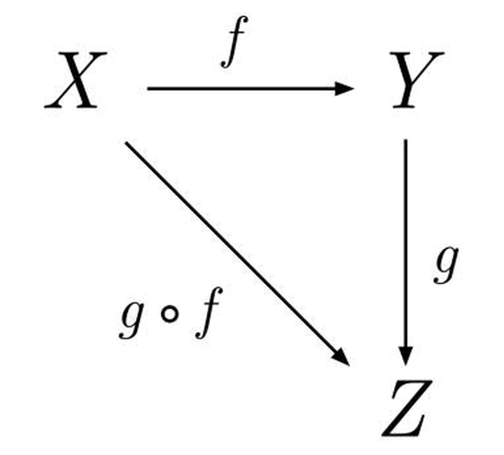

## Hardcore Functional Programming in JavaScript, v2
> Frontend Masters: Brian Lonsdorf

**Introduction**


- Function Programming is programming with functions.
- In JavaScript a function can be either first-order or higher-order.
> -The functions that use other functions as arguments or return functions are named **higher-order** functions.
> -The functions that use only primitives or objects as arguments, and only return primitives or objects are named **first-order** functions.
`We could think that a higher-order function accepts or returns callback functions.`
- The higher-order functions help reduce the code duplication and favor the single-responsibility principle.
- The built-in JavaScript function on arrays, strings, DOM methods, promise method — we could notice that many of them are higher-order functions as soon as they accept a function as an argument, Example:
```ruby
    // --------------------
    // the array.map(mapperFunc) method is a higher-order function
    // because it accepts a mapper function as an argument.
    // --------------------
    const numbers = [1, 2, 4];

    const doubles = numbers.map(function mapper(number) {
        return 2 * number;
    });

    doubles; // [2, 4, 8]

    // --------------------
    // element.addEventListener(type, handler) DOM method is also
    // a higher-order function since it accepts as the second argument
    // the event handler function.
    // --------------------

    document.getElementById('#myButton')
            .addEventListener('click', function handler() {
                console.log('The button was clicked!');
            });

```
**The advantages of Functional Programming**

- Functional (in general, declarative) programming is often described as expressing what is being computed rather than how.
- Functional Programs contain no assignment statements, so variables, once given a value, never change.
  
  - **No side effects:** A function, if all parameters are defined by value and no assignments are made to global variables, will have no side effects. `Functional Programs contain no side-effects of any kind.`
  - **Lazy:** That means that unless specifically told otherwise, FP won't execute functions and calculate things until it's really forced to show you a result. That goes well with referential transparency and it allows you to think of programs as a series of transformations on data.
  - **Statically typed:** When you compile your program, the compiler knows which piece of code is a number, which is a string and so on. That means that a lot of possible errors are caught at compile time. If you try to add together a number and a string, the compiler will whine at you.
  - ***Elegant and concise:*** Because it uses a lot of high level concepts, programs are usually shorter than their imperative equivalents. And shorter programs are easier to maintain than longer ones and have less bugs.
  - **Data storage:** is implicit, so operations allocate storage only when needed and then automatically release it if it becomes inaccessible.
  - **The Functions** become first class values and will be on the same level as any other value. A function may be the value of an expression, passed as an argument and placed in a data structure.
  `Functions are treated as first-class objects, are allowed to be recursive, higher order and polymorphic.`

**The disadvantages of Functional Programming**
- Data cannot be modified, that is, variables.
- It is not recommended to use it for database and/or server connections. In addition, it does not have efficient access to large amounts of data.
- It is not the best option for recursions of the same stack.
- We can have serious errors in recursive programming.
  
**Theory of categories**
  > Also known as the mathematics of mathematics, it was proposed in 1945 as a tool to transfer mathematical problems from one field to another.

  - A category is formed by a class of objects together with a class of morphisms - `a type of processes or paths` - on those objects.

    - A category is a point in space. `category = dot`
    - A morphism is an arrow or a process. `morphism = arrow`
  


The fundamental requirement to be met by the categories is that if we have a morphism from one point(object) _x_ to another _y_, and another from _y_ to _z_, it is possible to compose them and obtain a morphism from _x_ to _z_. 
This means that if we have a **number** type and we need to transform it into a **string**, a **toString** morphism is required.
`toString:: number -> string`

> The theory of categories is basically an abstraction applied to a specific problem.
> A program is also a way of transforming a set of input data into output data, and the easiest way to build complicated programs is to compose simpler programs.

**Functions**

> first class citizens == functions as values
> -is to do with a function everything that can be done with a value

- A function is a process which takes some input, called arguments, and produces some output called a return value.
   - Total: For every input there is a corresponding output.
   - Deterministic: Always receive the same output for a given input.
   - No Observable Side-Effects: No observable effects besides computing a value.
`JavaScript functions are similar to algebraic functions.`


    ```math
        f(x) = 2x 
    ```
    ```math
        f(3) = 2(3) = 6
    ```
    ```ruby
        const double = (x) => x * 2;

        double(3); // 6
    ```
- **Pure Functions**
  - Pure functions are predictable.
  - Always return the same result. 
  - Given the same input, always returns the same output.
  - Pure function does not produce any observable side effects such as network requests or data mutation etc.
  
  ```ruby
        Math.max(2, 8, 5); // 8
  ```
1. **Currying**
   - **Properties**
    
    ```ruby
            // associative
            add(add(x, y), z) == add(x, add(y, z))
            
            // commutative
            add(x, y) == add(y, x)
            
            // identity
            add(x, 0) == x
            
            // distributive
            add(multiply(x, y), multiply(x, z)) == multiply(x, add(y,z))
    ```
   - Example:
  
    ```ruby
    const add = (x, y) => x + y ;

    const toPair   = f => ([x, y]) => f(x, y);

    const fromPair = f => (x, y) => f([x, y]);

    const result = fromPair(toPair(add))(1, 2);

    console.log(result); // 3
    ```
   - **curry:** is possible thanks to closure and is to decompose functions into smaller functions so that each one receives an argument.
   - It divides your function into multiple smaller functions that can handle one responsibility. 
   - This makes your function pure and less prone to errors and side effects.
   - Currying doesn’t call a function. `It just transforms it.`
  
    ```ruby
        const add = (x, y) => x + y ;

        const curry = f => x => y => f(x, y);

        const curryAdd = curry(add)(7)(3);
        console.log(curryAdd) //10

        //-----------------------
        // Noncurried
        function sumThreeNumbers(a, b, c){
            return a + b + c;
        }

         sumThreeNumbers(1, 2, 3); // 6

        // Curried
        function sumThreeNumbers(a){
            return function(b){
                return function(c){
                    return a + b + c;
                }
            }
        }

         sumThreeNumbers(1)(2)(3); // 6

         // ---------------------

         const sumThreeNumbers = a => b => c => a + b + c;
         const suma3num = sumThreeNumbers(1)(2)(3); 
         console.log(suma3num); // 6


    ```
    >  currying is when a function — instead of taking all arguments at one time — takes the first one and returns a new function, which takes the second one and returns a new function, which takes the third one, etc. until all arguments are completed.
     - Currying can be used to manipulate the DOM:
     ```ruby
            const updateElemText = id => content => document.querySelector(`#${id}`).textContent= content;
            const updateHeaderText = updateElemText('header');
            updateHeaderText('Hello Andres!');  
     ```  
   - Currying vs Partial Application:
     - Partial application: a function is partially applied when it is given fewer arguments than it expects and returns a new function expecting the remaining arguments.
     ```ruby
        const addPartial = (x,y,z) => {
            return x + y + z; 
        }

        var partialFunc= addPartial.bind(this,2,3);

        partialFunc(5); //returns 10
     ```
    > Currying and partial application are not really different; they are related, but they have different theories and applications.

    > the general rule when defining curried function is the data it operates on ends up last.

***

**Composition**

- It is combining simple functions to create more complex functions.
- In mathematics, the composition of a function is defined as: (f ◦ g)(x) = f (g(x))

```math
    f(x) = 5x + 3
```

```math
    g(x) = 2x - 1
```

```math
    f(g(x)) = 5(2x - 1) + 3 
```
```math
    f(g(x)) = 10x - 2
```
```ruby
    const compose = (f, g) => (x) => f(g(x));
```

- The functions are executed from right to left as they are passed to the compose function.
- The type of data resulting from a function must be the same as that accepted as input by the following function.
- To compose functions it is important to process abstract data, in other words, the function processes the data in a generic way. (point free).
  ```ruby
    // No es point free porque esta especificando 
    // el tipo de dato que espera
    var snakeCase = function(word) {
        return word.toLowerCase().replace(/\s+/ig, '_');
    };

    // Si es pointfree
    var snakeCase = compose(replace(/\s+/ig, '_'), toLowerCase);
  ```
- Ejemplo de composicion
  ```ruby
        const compose = (f, g) => x => f(g(x));

        const toUpper = str => str.toUpperCase();
        const exclaim = str => str + '!';
        const please = str => str + 'Please';

        const shout = compose(toUpper, exclaim);

        console.log(shout('here..')); // HERE..!

        const shout1 = compose(shout, please);

        console.log(shout1('Andres ')); // ANDRES PLEASE!

  ```
- Example of composition with ramda
  ```ruby
    // Calcular el promedio de ingresos de todos los usuarios.
    import { prop, map, reduce, add, compose } from 'ramda';

    const average = (xs) => reduce(add, 0, xs) / xs.length;

    const incomesAverage = compose(average, map(prop('incomes')));

    incomesAverage(USERS) // 8333.333
  ```
  > Function composition creates function pipelines that your data flows through. You put some input in the first stage of the pipeline, and some data pops out of the last stage of the pipeline, transformed. But for that to work, each stage of the pipeline must be expecting the data type that the previous stage returns.
***

**Functors**

- An object we can map and apply a function in order to generate another object of the same type.
- Functor laws:
    - Identity: If you pass in an identity function into your functor's mapping interface, the final returned collection should be equivalent to your original functor.
    - Composition: 
        ```ruby
        const f = (x) => x * 2;
        const g = (x) => x + 1;
        const F = [1, 3, 5];
                      
        F.map(x => f(g(x))) == F.map(g).map(f)

        console.log(F.map(x => f(g(x)))); //[4, 8, 12]
        console.log(F.map(g).map(f)); //[4, 8, 12]

        ```
Examples:
```ruby
        const add1 = value => value + 1;
        const times2 = value => value * 2;
        const numbers = [3, 5, 7];

        const nestedNumbers = numbers.map(value => add1(times2(value)));
        console.log(nestedNumbers); // [7, 11, 15]

        const chainedNumbers = numbers.map(times2).map(add1);
        console.log(chainedNumbers); // [7, 11, 15]
```

```ruby
    const Functor = (value) => ({
        map: fn => Functor(fn(value)),
        value,
    });
```

> promises use functor when chaining different consecutive **then( )** methods to transform the data.
```ruby
    const promise = new Promise((resolve, reject) => {
        resolve(1);
    }).then(add1)
      .then(times2);
      
    promise.then(console.log); // 4
```
> Un functor hace lifting sobre un valor, es decir que el valor es dejado en una caja. (content lifting)
***

**Either Monad**
- Monads are functors that implement flatMap.
- A monad is a way of composing functions that require context in addition to the return value.
- Allow us to handle asynchronous code.
  
> the essence of software development is composition, and monads make composition easier.


_The End_


