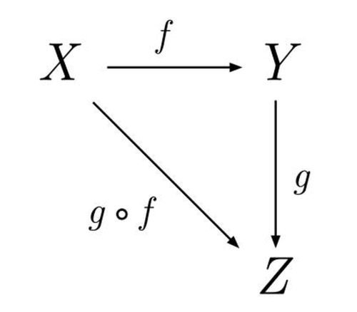

## Hardcore Functional Programming in JavaScript, v2
> Frontend Masters: Brian Lonsdorf

**Introduction**


- Function Programming is programming with functions.
- In JavaScript a function can be either first-order or higher-order.
> -The functions that use other functions as arguments or return functions are named **higher-order** functions.
> -The functions that use only primitives or objects as arguments, and only return primitives or objects are named **first-order** functions.
`We could think that a higher-order function accepts or returns callback functions.`
- The higher-order functions help reduce the code duplication and favor the single-responsibility principle.
- The built-in JavaScript function on arrays, strings, DOM methods, promise method — we could notice that many of them are higher-order functions as soon as they accept a function as an argument, Example:
```ruby
    // --------------------
    // the array.map(mapperFunc) method is a higher-order function
    // because it accepts a mapper function as an argument.
    // --------------------
    const numbers = [1, 2, 4];

    const doubles = numbers.map(function mapper(number) {
        return 2 * number;
    });

    doubles; // [2, 4, 8]

    // --------------------
    // element.addEventListener(type, handler) DOM method is also
    // a higher-order function since it accepts as the second argument
    // the event handler function.
    // --------------------

    document.getElementById('#myButton')
            .addEventListener('click', function handler() {
                console.log('The button was clicked!');
            });

```
**Teroia de las categorias**
  > Tambien conocida como las matematicas de las matematicas, fue propuesta en 1945 como una herramienta para trasladar problemas matematicos de un campo a otro.

  - Una categoria esta formada por una clase de objetos junto a una clase de morfismos - `un tipo de procesos ó caminos ` - sobre esos objetos.
    - Una categoria es un punto en el espacio. `category = dot`
    - Un morfismo es una flecha un proceso. `morphism = arrow`
  


El requerimiento fundamental que han de cumplir las categorías es que si tenemos un morfismo de un punto(objeto) _x_ a otro _y_, y otro de _y_ a _z_, es posible componerlos y obtener un morfismo de _x_ a _z_. 
Es decir, que si tenemos un tipo number y necesitamos transformarlo en un string, se requiere un morfismo toString.
`toString:: number -> string`

> La teoria de las categorias es basicamente una abstraccion aplicada a un problema particular.
> un programa es también una manera de transformar una serie de datos de entrada en datos de salida y la manera más sencilla de construir programas complicados es componer programas más simples.

**Functions**

> first class citizens == functions as values
> -hacer con una función todo lo que se puede hacer con un valor

- A function is a process which takes some input, called arguments, and produces some output called a return value.
   - Total: For every input there is a corresponding output.
   - Deterministic: Always receive the same output for a given input.
   - No Observable Side-Effects: No observable effects besides computing a value.
`JavaScript functions are similar to algebraic functions.`


    ```math
        f(x) = 2x 
    ```
    ```math
        f(3) = 2(3) = 6
    ```
    ```ruby
        const double = (x) => x * 2;

        double(3); // 6
    ```
- **Pure Functions**
  - Pure functions are predictable.
  - Always return the same result. 
  - Given the same input, always returns the same output.
  - Pure function does not produce any observable side effects such as network requests or data mutation etc.
  
  ```ruby
        Math.max(2, 8, 5); // 8
  ```
1. **Currying**
   - **Properties**
    
    ```ruby
            // associative
            add(add(x, y), z) == add(x, add(y, z))
            
            // commutative
            add(x, y) == add(y, x)
            
            // identity
            add(x, 0) == x
            
            // distributive
            add(multiply(x, y), multiply(x, z)) == multiply(x, add(y,z))
    ```
   - Example:
  
    ```ruby
    const add = (x, y) => x + y ;

    const toPair   = f => ([x, y]) => f(x, y);

    const fromPair = f => (x, y) => f([x, y]);

    const result = fromPair(toPair(add))(1, 2);

    console.log(result); // 3
    ```
   - **curry:** es posible gracias al closure y es descomponer funciones en funciones mas pequeñas para que cada una reciba un argumento.
   - It divides your function into multiple smaller functions that can handle one responsibility. 
   - This makes your function pure and less prone to errors and side effects.
   - Currying doesn’t call a function. `It just transforms it.`
  
    ```ruby
        const add = (x, y) => x + y ;

        const curry = f => x => y => f(x, y);

        const curryAdd = curry(add)(7)(3);
        console.log(curryAdd) //10

        //-----------------------
        // Noncurried
        function sumThreeNumbers(a, b, c){
            return a + b + c;
        }

         sumThreeNumbers(1, 2, 3); // 6

        // Curried
        function sumThreeNumbers(a){
            return function(b){
                return function(c){
                    return a + b + c;
                }
            }
        }

         sumThreeNumbers(1)(2)(3); // 6

         // ---------------------

         const sumThreeNumbers = a => b => c => a + b + c;
         const suma3num = sumThreeNumbers(1)(2)(3); 
         console.log(suma3num); // 6


    ```
    >  currying is when a function — instead of taking all arguments at one time — takes the first one and returns a new function, which takes the second one and returns a new function, which takes the third one, etc. until all arguments are completed.
     - Currying can be used to manipulate the DOM:
     ```ruby
            const updateElemText = id => content => document.querySelector(`#${id}`).textContent= content;
            const updateHeaderText = updateElemText('header');
            updateHeaderText('Hello Andres!');  
     ```  
   - Currying vs Partial Application:
     - Partial application: a function is partially applied when it is given fewer arguments than it expects and returns a new function expecting the remaining arguments.
     ```ruby
        const addPartial = (x,y,z) => {
            return x + y + z; 
        }

        var partialFunc= addPartial.bind(this,2,3);

        partialFunc(5); //returns 10
     ```
    > Currying and partial application are not really different; they are related, but they have different theories and applications.

    > the general rule when defining curried function is the data it operates on ends up last.

***

**Composition**

- Es combinar funciones simples para crear funciones mas complejas.
- En matemáticas, la composición de una función es definida como: (f ◦ g)(x) = f (g(x))

```math
    f(x) = 5x + 3
```

```math
    g(x) = 2x - 1
```

```math
    f(g(x)) = 5(2x - 1) + 3 
```
```math
    f(g(x)) = 10x - 2
```
```ruby
    const compose = (f, g) => (x) => f(g(x));
```

- Las funciones se ejecutan de derecha a izquierda según se pasen a la función compone.
- El tipo de dato que resulta de una función, debe ser el mismo que acepta como entrada la siguiente función.
- Para componer funciones es importante procesar datos abstractos, es decir que la funcion procesa los datos de forma generica (point free).
  ```ruby
    // No es point free porque esta especificando 
    // el tipo de dato que espera
    var snakeCase = function(word) {
        return word.toLowerCase().replace(/\s+/ig, '_');
    };

    // Si es pointfree
    var snakeCase = compose(replace(/\s+/ig, '_'), toLowerCase);
  ```
- Ejemplo de composicion
  ```ruby
        const compose = (f, g) => x => f(g(x));

        const toUpper = str => str.toUpperCase();
        const exclaim = str => str + '!';
        const please = str => str + 'Please';

        const shout = compose(toUpper, exclaim);

        console.log(shout('here..')); // HERE..!

        const shout1 = compose(shout, please);

        console.log(shout1('Andres ')); // ANDRES PLEASE!

  ```
- Ejemplo de composicion con ramda
  ```ruby
    // Calcular el promedio de ingresos de todos los usuarios.
    import { prop, map, reduce, add, compose } from 'ramda';

    const average = (xs) => reduce(add, 0, xs) / xs.length;

    const incomesAverage = compose(average, map(prop('incomes')));

    incomesAverage(USERS) // 8333.333
  ```
  > Function composition creates function pipelines that your data flows through. You put some input in the first stage of the pipeline, and some data pops out of the last stage of the pipeline, transformed. But for that to work, each stage of the pipeline must be expecting the data type that the previous stage returns.
***

**Functors**

- An object we can map and apply a function in order to generate another object of the same type.
- Functor laws:
    - Identity: If you pass in an identity function into your functor's mapping interface, the final returned collection should be equivalent to your original functor.
    - Composition: 
        ```ruby
        const f = (x) => x * 2;
        const g = (x) => x + 1;
        const F = [1, 3, 5];
                      
        F.map(x => f(g(x))) == F.map(g).map(f)

        console.log(F.map(x => f(g(x)))); //[4, 8, 12]
        console.log(F.map(g).map(f)); //[4, 8, 12]

        ```
Examples:
```ruby
        const add1 = value => value + 1;
        const times2 = value => value * 2;
        const numbers = [3, 5, 7];

        const nestedNumbers = numbers.map(value => add1(times2(value)));
        console.log(nestedNumbers); // [7, 11, 15]

        const chainedNumbers = numbers.map(times2).map(add1);
        console.log(chainedNumbers); // [7, 11, 15]
```

```ruby
    const Functor = (value) => ({
        map: fn => Functor(fn(value)),
        value,
    });
```

> las promesas usan functor cuando se encadenan diferentes metodos **then( )** consecutivos, para tranformar la data.
```ruby
    const promise = new Promise((resolve, reject) => {
        resolve(1);
    }).then(add1)
      .then(times2);
      
    promise.then(console.log); // 4
```
> Un functor hace lifting sobre un valor, es decir que el valor es dejado en una caja. (content lifting)
***

**Either Monad**
- Monads are functors that implement flatMap.
- A monad is a way of composing functions that require context in addition to the return value.
- Allow us to handle asynchronous code.
  
> the essence of software development is composition, and monads make composition easier.


_The End_


