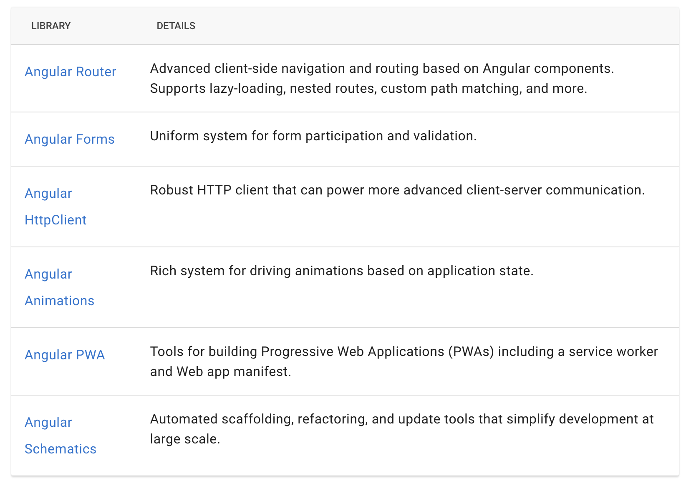
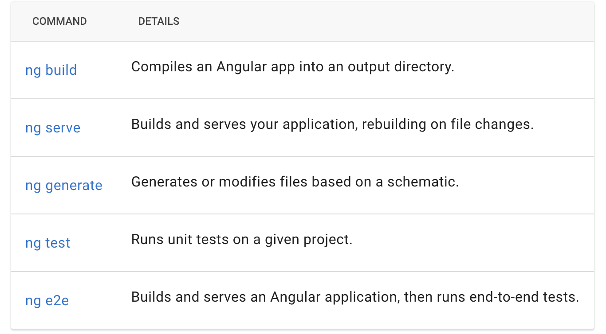

## Angular

>Angular is an application design framework and development platform for creating efficient and sophisticated single-page apps.
***
**TypeScript**
- Angular was written in TypeScript, a typed superset of JavaScript that implements many modern EcmaScript features.
> ES6 is the current version of JavaScript. TypeScript is a superset of ES6, which means all ES6 features are part of TypeScript, but not all TypeScript features are part of ES6. Consequently, TypeScript must be transpiled into ES5/ES6 to run in most browsers.

**Definitions**

- **ahead-of-time AOT**
  - The Angular ahead-of-time (AOT) compiler converts your Angular HTML and TypeScript code into efficient JavaScript code during the build phase before the browser downloads and runs that code. 
  - Compiling your application during the build process provides a faster rendering in the browser. 
  - **Ahead-of-Time (AOT)** -	Compiles your application and libraries at build time. This is the default starting in Angular 9.
  - **Just-in-Time (JIT)** - Compiles your application in the browser at runtime. This was the default until Angular 8.
  > When you run the ng build (build only) or ng serve (build and serve locally) CLI commands, the type of compilation (JIT or AOT) depends on the value of the aot property in your build configuration specified in angular.json. By default, aot is set to true for new CLI applications.

- **Module**
  - In general, a module collects a block of code dedicated to a single purpose. 
  - Angular uses standard JavaScript modules and also defines an Angular module, `NgModule`.
  - In JavaScript, or ECMAScript, each file is a module and all objects defined in the file belong to that module.
  - Objects can be exported, making them public, and public objects can be imported for use by other modules.
  - **Types:**
     - Root Module - main module `AppModule`
     - Routing Module - Module dedicated to routing rules `AppRoutingModule`
     - Feature Module: are modules that encapsulate elements of the application that turn around a business unit.
  - **Properties:**
    - Declarations
    - Exports
    - Imports
    - Providers
    - Bootstrap - Root module only.   

  - Angular ships as a collection of JavaScript modules. 
  - A collection of JavaScript modules are also referenced as a library. 
  - Each Angular library name begins with the @angular prefix. 
  - Install Angular libraries with the npm package manager and import parts of them with JavaScript import declarations.
  
- **Components**
  - Components are the most basic UI building block of an Angular application. 
  - Basically, a component is anything that is visible to the end user and which can be reused many times within an application.
  - Each component consists of:
    - An HTML template that declares what renders on the page
    - A TypeScript class that defines behavior
    - A CSS selector that defines how the component is used in a template.
    - Optionally, CSS styles applied to the template
    - When you utilize the providers field in the Component Decorator, any services you pass into that array, will be uniquely instantiated for that particular component!
  > The core concept of any Angular application is the component. In effect, the whole application can be modeled as a tree of these components.

- **Binding** 
  - A process that allows applications to display data values to a user and respond to user actions. 
  - User actions include clicks, touches, keystrokes, and so on. 
  - Passing Data:
    - **Interpolation** `{{property}}` - uses the double curly braces {{ and }} as delimiters
    - **Property binding** `[objChild]="objParent"`- enclose it in square brackets, which identifies the property as a target property.
    - **Event binding** `(click)=onSave()` - lets you listen for and respond to user actions such as keystrokes, mouse movements, clicks, and touches
    - **Attribute binding** `[attr.aria-label]="actionName"` - you can improve accessibility, style your application dynamically, and manage multiple CSS classes or styles simultaneously.
    - **Class and style binding** `[class.sale]="onSale"` - to add and remove CSS class names from an element's class attribute and to set styles dynamically.
    - **Two-way data binding with ngModel** - to listen for events and update values simultaneously between parent and child components.

- **Directive**
   - A class that can modify the structure of the DOM `Document Object Model` or modify attributes in the DOM and component data model.
   - There are three main types of directives in Angular:
     - **Component** - directive with a template.
     - **Attribute directives** - directives that change the behavior of a component or element but _don't affect_ the template. `ngStyle, ngClass`
     - **Structural directives** - directives that change the behavior of a component or element by _affecting_ how the template is rendered. `ngFor, ngIf, ngSwitch`
>  In fact, Angular components are in large part directives with templates. 

- **Life cycle Hooks** 
   - Here is the complete lifecycle hook interface inventory:
     - ngOnChanges - called when an input binding value changes
     - ngOnInit - after the first ngOnChanges
     - ngDoCheck - after every run of change detection
     - ngAfterContentInit - after component content initialized
     - ngAfterContentChecked - after every check of component content
     - ngAfterViewInit - after component's view(s) are initialized
     - ngAfterViewChecked - after every check of a component's view(s)
     - ngOnDestroy - just before the component is destroyed 

- **Router**
  - A service that provides navigation among views and URL manipulation capabilities. 
  - Router.events provides events as observables. 
  - You can use the filter() operator from RxJS to look for events of interest, and subscribe to them in order to make decisions based on the sequence of events in the navigation process.

- **Router outlet**
  - The RouterOutlet is a directive from the router library that is used like a component. 
  - It acts as a placeholder that marks the spot in the template where the router should display the components for that outlet.

- **Accessing Other Components** 
   - The **@ViewChild** and **@ViewChildren** decorators provide access to the instantiated class of child components, allowing you to interact with non-private fields programmatically. 

- **Service**
  - In Angular, a class with the @Injectable() decorator that encapsulates non-UI logic and code that can be reused across an application. Angular distinguishes components from services to increase modularity and reusability. 
  - Service is a broad category encompassing any value, function, or feature that an application needs. 
  - A service is typically a class with a narrow, well-defined purpose. It should do something specific and do it well. 
  - Angular distinguishes components from services to increase modularity and reusability.
  - Services are good for tasks such as fetching data from the server, validating user input, or logging directly to the console. 
  - By defining such processing tasks in an injectable service class, you make those tasks available to any component. 
  - You can also make your application more adaptable by injecting different providers of the same kind of service, as appropriate in different circumstances. 
  - Services can depend on other services.
  - A component should use services for tasks that don't involve the view or application logic. 
  - The injectable class is instantiated by a provider. 
  - Injectors maintain lists of providers and use them to provide service instances when they are required by components or other services.
  > The @Injectable() metadata allows the service class to be used with the dependency injection mechanism.

- **Dependency injection** 
  - Dependencies are services or objects that a class needs to perform its function. 
  - Dependency injection, or DI, is a design pattern in which a class requests dependencies from external sources rather than creating them.
  - The **@Injectable()** decorator specifies that Angular can use this class in the DI system. 
  - The metadata, `providedIn: 'root'`, means that the HeroService is visible throughout the application.
  
- **injector**
  - An object in the Angular dependency-injection system that can find a named dependency in its cache or create a dependency using a configured provider.  
  - An injector provides a singleton instance of a dependency, and can inject this same instance in multiple components. 
- **EventEmitter**
  - EventEmitter is responsible for raising the event. 
  - The @output property normally is of type EventEmitter. 
  - The child component will use the emit() method to emit an event along with the data.

- **Pipes**
  - Pipes are a way to transform the format of output data for display 
  - Pipes are simple functions that accept an input and return a transformed value in a more technical understanding. 
  -  In Angular, Pipes are of two types.
    - Pure Pipes
    - Impure Pipes

- **Pure Pipe**
  - Pure pipes in angular are the pipes that execute when it detects a pure change in the input value.
  - A pure change is when the change detection cycle detects a change to either a primitive input value (such as String, Number, Boolean, or Symbol) or object reference (such as Date, Array, Function, or Object).
  - A pure function does not depend on any state, data, or change during the execution. In other words, given the same arguments, a pure function should always return the same output.
  > By default, pipes in angular are pure pipes. Custom pipes can be defined as pure pipes by turning the pure flag to true of the @Pipe decorator.
  ```js
    @Pipe({
    name: 'purePipe',
    pure: true	
    })
    export class PurePipe {}

  ```
  
- **Impure Pipe**
  - Impure pipes in angular are the pipes that execute when it detects an impure change in the input value. 
  - An impure change is when the change detection cycle detects a change to composite objects, such as adding an element to the existing array. 
  - Impure pipes execute every time angular detects any changes regardless of the change in the input value.
  - An **impure function** depends on any state, data, or change during the execution and may not return the same result if the same inputs are passed into the respective function.
> Async pipe is an example of an Impure pipe.

- **Async Pipe | async**
  - The async pipe is an impure pipe that saves boilerplate code in your component to maintain the subscription and keep delivering values from that observable as they arrive. 
  - The async pipe subscribes to an Observable or Promise and returns the latest value it has emitted. 
  - When a new value is emitted, the async pipe marks the component to be checked for changes. 
  - When the component gets destroyed, the async pipe unsubscribes automatically to avoid potential memory leaks. 

- **Observables**
  - Observables are recommended for event handling, asynchronous programming, and handling multiple values. 
  - Observables can deliver single or multiple values of any type, either **synchronously** (as a function delivers a value to its caller) or **asynchronously** on a schedule. 
  - Angular makes use of observables as an interface to handle a variety of common asynchronous operations. For example:
    - The HTTP module uses observables to handle AJAX requests and responses
    - The Router and Forms modules use observables to listen for and respond to user-input events


- **@Decorator** 
  - A decorator that appears immediately before a class definition, which declares the class to be of the given type, and provides metadata suitable to the type.
  - A function that modifies a class or property definition. 
  - Angular defines decorators that attach metadata to classes or properties so that it knows what those classes or properties mean and how they should work.
  - A decorator defines which parts an element has in Angular and allows to extend the functionality of a function using another function.
  - It is an implementation of the decorator design pattern and can be:
    - class - @Component @NgModule
    - property - @Input @Output
    - methods - @Hostlistener
    - parameter - @Inject() In the constructor  

- **ng-template** 
  - ng-template is a virtual element and its contents are displayed only when needed (based on conditions).
  - ng-template should be used along with structural directives like [ngIf],[ngFor],[NgSwitch] or custom structural directives.That is why in the above example the contents of ng-template are not displayed. 
  - With <ng-template>, you can define template content that is only being rendered by Angular when you, whether directly or indirectly, specifically instruct it to do so, allowing you to have full control over how and when the content is displayed.
  - ng-template never meant to be used like other HTML elements. It’s an internal implementation of Angular’s structural directives.

- **ng-container** 
  - ng-container allows us to create a division or section in a template without introducing a new HTML element.
  - ng-container is not a directive, component, class, or interface, but just a syntax element. 
  - The <ng-container> allows us to use structural directives without any extra element, making sure that the only DOM changes being applied are those dictated by the directives themselves.
  - This not only increases performance (even so slightly) since the browser ends up rendering less elements but can also be a valuable asset in having cleaner DOMs and styles alike.
  - It can for example enable us to use structural directives without breaking styling dependent on a precise DOM structure (as for example the ones we get when using flex containers, margins, the child combinator selector, etc.).


- **First-party libraries**
   These libraries are only required if and when they can help you add functionality to your applications or solve a particular problem.
   

- **HTPP**
  - Angular's HttpClient returns observables from HTTP method calls. For instance, http.get('/api') returns an observable. This provides several advantages over promise-based HTTP APIs:
    - Observables do not mutate the server response (as can occur through chained .then() calls on promises). Instead, you can use a series of operators to transform values as needed.
    - HTTP requests are cancellable through the unsubscribe() method
    - Requests can be configured to get progress event updates
    - Failed requests can be retried easily


- **HttpClient**
  - To communicate with backend services using HTTP, the HttpClient service uses observables and offers the HttpClient.get() method to fetch data from a server. 
  - The asynchronous method sends an HTTP request, and returns an observable that emits the requested data for the response.
  - To use HttpClient in Angular applications follow the below steps:
    - import HttpClientModule from @angular/common/http in Angular’s app.module.ts file.
    - Add HttpClientModule to the imports array of NgModule.
    - Finally inject the HttpClient service in application class or service as a dependency.


***
**Angular CLI**
The Angular CLI is a command-line interface tool that you use to initialize, develop, and maintain Angular applications directly from a command shell.

***

- **polyfill**
  - An npm package that plugs gaps in the JavaScript implementation of a browser. See Browser Support for polyfills that support particular functionality for particular platforms.

- **lazy loading**
  - A process that speeds up application load time by splitting the application into multiple bundles and loading them on demand.

- **Standalone Components**
  - The term “standalone” refers to components, directives, or pipes that can be used independently of NgModule. 
  - It create an application without NgModules 
  - Angular 14 introduces the standalone component — a component not part of any ngModule that can be used with either other standalone or module-based components.