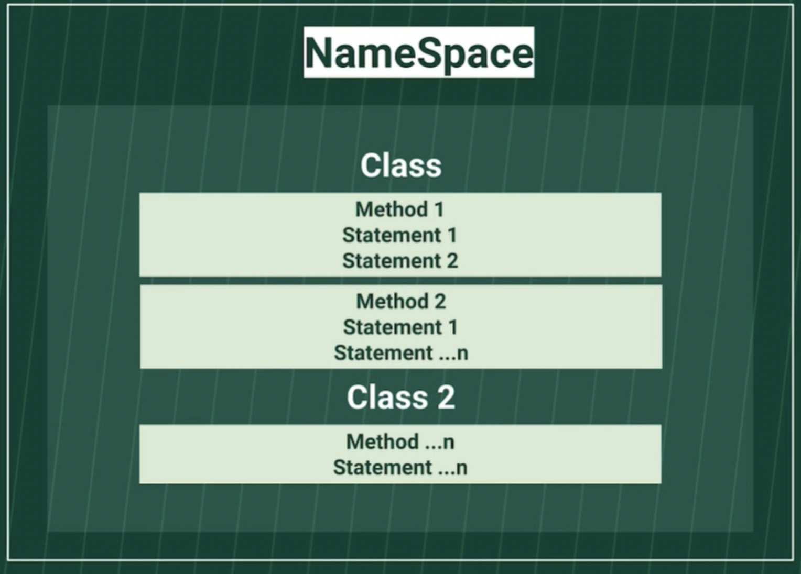

## C# 

> C# is a general-purpose, modern and object-oriented programming language pronounced as “C Sharp”. 
> It was developed by Microsoft led by Anders Hejlsberg and his team within the .NET initiative and was approved by the European Computer Manufacturers Association (ECMA) and International Standards Organization (ISO). 
> - C# is among the languages for Common Language Infrastructure. 
> - C# is a lot similar to Java syntactically and is easy for users who have knowledge of C, C++ or Java.

***

## Content

- [Introduction](#introduction)
- [Namespace](#namespace)
- [Using](#using)
- [Data Types](#data-types)
- [Casting and type conversions](#casting-and-type-conversions)
- [Variables](#variables)
- [String](#string)
- [Print](#print)
- [Nullable](#nullable)
- [Object](#object)
- [Array](#array)
- [Serialization](#serialization)
- [XSD file](#xsd-file)
- [Interface](#interface)
- [Class](#class)
- [Method](#method)
- [Structure](#structure)
- [Delegate](#delegate)
- [Events](#events)
- [Constructor](#constructor)
- [Destructor](#destructor)
- [Generics](#generics)
- [Binding](#binding)
- [Dependency Injection](#dependency-injection)
- [HashSet](#hashset)
- [Types of Control](#types-of-control)
- [Thread and Multithreading](#thread-and-multithreading)
- [Constants](#constants)
- [Boxing and Unboxing](#boxing-and-unboxing)
- [Get and Set](#get-and-set)
- [Async and Await](#async-and-await)
- [Deadlock](#deadlock)
- [Costum Control](#costum-control)
- [Circular references](#circular-references)
- [Exception handling](#exception-handling)
- [System.IO](#systemio)
- [Finally and Finalize block](#finally-and-finalize-block)
- [Lock, Monitors, and Mutex Object in Threading.](#lock-monitors-and-mutex-object-in-threading)
- [Race Condition](#race-condition)
- [Thread Pooling](#thread-pooling)


# Introduction

- The four fundamental concepts of **object-oriented programming** can be explained as follows:
  - **Encapsulation:** 
    - It is the bundling of data, including the methods that operate on that data, into a single, private unit
    - The Internal representation of an object is hidden from the view outside the object‘s definition. Only the required information can be accessed, whereas the rest of the data implementation is hidden.
  - **Polymorphism:** 
    - It is the ability of a type to take on many forms using a single interface
    - The name means, one name, many forms. It is achieved by having multiple methods with the same name but different implementations.
  - **Abstraction:** 
    - It is the concealment of unnecessary program details so that the user only sees the essential attributes.
    - It is a process of identifying the critical behavior and data of an object and eliminating the irrelevant details.
  - **Inheritance:** 
    - It is the process where one class derives (or inherits) its attributes and methods from another
    - It is the ability to create new classes from another class. It is done by accessing, modifying, and extending the behavior of objects in the parent class.
    - Inheritance in OOP is of four types:
      - Single inheritance - Contains one base class and one derived class
      - Hierarchical inheritance - Contains one base class and multiple derived classes of the same base class
      - Multilevel inheritance - Contains a class derived from a derived class
      - Multiple inheritance - Contains several base classes and a derived class
      - All .NET languages support single, hierarchical, and multilevel inheritance. 
      - They do not support multiple inheritance because, in these languages, a derived class cannot have more than one base class. 
      - However, you can implement multiple inheritance in .NET through interfaces.

- The **singleton** design pattern ensures that only one object of its kind exists, and provides global access to it for any other code. This design pattern can be implemented in a number of ways, using:
  - Thread-safety singleton
  - Thread-safety singleton using double-check locking
  - No thread-safe singleton
  - Thread-safe without a lock
  - .NET 4’s `Lazy<T> type`

[Back](#content)

# Namespace
- They are used to organize large code projects. “System” is the most widely used namespace in C#. We can create our own namespace and use one namespace in another, which are called Nested Namespaces.
- They are denoted by the keyword “namespace”.
- C# programs consist of one or more files. 
- Each file contains zero or more **namespaces**. 
- A **namespace** contains types such as classes, structs, interfaces, enumerations, and delegates, or other **namespaces**. 
- The following example is the skeleton of a C# program that contains all of these elements:

    ```cs
        // A skeleton of a C# program
        using System;

        // Your program starts here:
        Console.WriteLine("Hello world!");

        namespace YourNamespace
        {
            class YourClass
            {
            }

            struct YourStruct
            {
            }

            interface IYourInterface
            {
            }

            delegate int YourDelegate();

            enum YourEnum
            {
            }

            namespace YourNestedNamespace
            {
                struct YourStruct
                {
                }
            }
        }
    ```
       
- The entry point was a static method named **Main**

    ```cs
    class Program
        {
            static void Main(string[] args)
            {
                //Your program starts here...
                Console.WriteLine("Hello world!");
            }
        }
    ```

[Back](#content)

# Using
- “Using” Keyword denotes that the particular namespace is being used by the program.
> For Example, using System. Here System is a namespace. The class Console is defined under System. So we can use the console.writeline (“….”) or readline in our program.

[Back](#content)

# Data Types

> Data types are categorized based on how they store their value in the memory.

  | Data Type | Memory space | Range | Details |
  | ----------| ------------ | ----- | ------- |
  | short | 2 bytes | -32768 to 32768 | stores integers |
  | int | 4 bytes | -2147483648 to 2147483648 | stores integers |
  | long | 8 bytes | -9223372036854775808 to 9223372036854775808 | stores integers |
  | bool | 1 bit | 0 to 1  | stores a value that can be true or false |
  | float | 4 bytes | 6 to 7 digits  | stores decimal numbers |
  | double | 8 bytes | up to 15 digits | stores decimal numbers |
  | char | 2 bytes | a single character | stores a single character or letter |
  | string | 2 bytes per character | - | stores a sequence of characters |
  | uint | 4 bytes | 0 to 4294967295 | stores positive integers |


[Back](#content)

# Casting and type conversions

- A conversion causes an expression to be converted to, or treated as being of, a particular type; in the former case a conversion may involve a change in representation. 
- Conversions can be **implicit** or **explicit**, and this determines whether an explicit cast is required.

- In C#, you can perform the following kinds of conversions:
  - **Implicit conversions:** No special syntax is required because the conversion always succeeds and no data will be lost. `Auto`
  - **Explicit conversions (casts):** Explicit conversions require a cast expression. Casting is required when information might be lost in the conversion, or when the conversion might not succeed for other reasons. `Manual`
  - **User-defined conversions:** User-defined conversions are performed by special methods that you can define to enable explicit and implicit conversions between custom types that do not have a base class–derived class relationship.
  - **Conversions with helper classes:** To convert between non-compatible types, such as integers and System.DateTime objects, or hexadecimal strings and byte arrays, you can use the System.BitConverter class, the System.Convert class, and the Parse methods of the built-in numeric types, such as Int32.Parse.

[Back](#content)

# Variables

- Variables represent storage locations. 
- Every variable has a type that determines what values can be stored in the variable. 
- C# is a type-safe language, and the C# compiler guarantees that values stored in variables are always of the appropriate type. 
- The value of a variable can be changed through assignment or through use of the ++ and -- operators.


[Back](#content)

# String

- A String is a collection of char objects. 
- We can also declare string variables in c#.
  ```cs
  string name = “C# Questions”;
  ```
- A **string class** in C# represents a string.
- The properties of String class are Chars and Length.
  - Chars get the Char object in the current String.
  - Length gets the number of objects in the current String.


- String interpolation: Available in C# 6.0 and later, interpolated strings are identified by the $ special character and include interpolated expressions in braces.

```cs
    var jh = (firstName: "Jupiter", lastName: "Hammon", born: 1711, published: 1761);
    Console.WriteLine($"{jh.firstName} {jh.lastName} was an African American poet born in {jh.born}.");
    Console.WriteLine($"He was first published in {jh.published} at the age of {jh.published - jh.born}.");
    Console.WriteLine($"He'd be over {Math.Round((2018d - jh.born) / 100d) * 100d} years old today.");

    // Output:
    // Jupiter Hammon was an African American poet born in 1711.
    // He was first published in 1761 at the age of 50.
    // He'd be over 300 years old today.
```

- Some of the basic string operations are:
    - **Concatenate** – Two strings can be concatenated either by using System.String.Concat or by using + operator.
    - **Modify** – Replace(a,b) is used to replace a string with another string. Trim() is used to trim the string at the end or at the beginning.
    - **Compare** – System.StringComparison() is used to compare two strings, either case-sensitive comparison or not case sensitive. Mainly takes two parameters, original string, and string to be compared with.
    - **Search** – StartWith, EndsWith methods are used to search a particular string.


- An **Escape sequence** is denoted by a backslash (\). 
  - The backslash indicates that the character that follows it should be interpreted literally or it is a special character. 
  - An escape sequence is considered as a single character.
  - String escape sequences are as follows:
  ```
        \n – Newline character
        \b – Backspace
        \\ – Backslash
        \‘ – Single quote
        \‘‘ – Double Quote
  ```


> String and StringBuilder: A string object is immutable, meaning that it cannot be changed after it’s created. Any operation that tries to modify the string object will simply create a new string object. On the other hand, a string builder object is mutable and can be modified as the developer sees fit.

[Back](#content)

# Print

- Console.WriteLine("Hello");
- string name = Console.ReadLine();


[Back](#content)

# Nullable

> The default value of a **reference type** variable is `null` when they are not initialized. 
> `Null means not refering to any object`.
> A **value type** variable cannot be `null` because it holds value, not a memory address.

- C# 2.0 introduced nullable types, using which you can assign null to a value type variable or declare a value type variable without assigning a value to it.

- Nullable types are used to represent an undefined value of an underlying type. It essentially means ‘no value’ and is generally used when no data is available for the field.
  ```cs
    Nullable<int> i = null;
  ```
- A nullable type can represent the correct range of values for its underlying value type, plus an additional null value. 
- For example, Nullable<int> can be assigned any value from -2147483648 to 2147483647, or a null value.

[Back](#content)


# Object
- Object in an instance of a Class. Technically, it is just a block of memory allocated that can be stored in the form of Variables, Array or a Collection.
- An object is a real-world entity and in C# it’s a single instance of a class. For example, if you had a class of ‘dogs’, ‘labradors’, ‘bulldogs’, and ‘golden retrievers’ would all be objects. 

[Back](#content)

# Array

- An Array is used to store multiple variables of the same type. 
- It is a collection of variables stored in a contiguous memory location.
- Array is a collection of data that stores a fixed number of values of the same data type. Arrays can be retrieved easily for the developer’s reference. 
  ```cs
    double numbers = new double[10];
    int[] score = new int[4] {25,24,23,25};
    int[,] numbers = new int[3,2] { {1,2} ,{2,3},{3,4} }; // Multidimensional
  ```
- Above example is a Single dimensional array.
- A Single dimensional array is a linear array where the variables are stored in a single row. 
- Arrays can have more than one dimension. 
- Multidimensional arrays are also called rectangular arrays.
- **Jagged Array**
  - A Jagged array is an array whose elements are arrays. 
  - It is also called an array of arrays. 
  - It can be either single or multiple dimensions.
  ```cs
   int[] jaggedArray = new int[4][];
  ```
- Properties of an Array include:
  - **Length** – Gets the total number of elements in an array.
  - **IsFixedSize** – Tells whether the array is fixed in size or not.
  - **IsReadOnly** – Tells whether the array is read-only or not.

- An **Array class** is the base class for all arrays. 
  - It provides many properties and methods. 
  - It is present in the namespace System.


- **Array and ArrayList:** An ArrayList has wider usage than an Array. 
- The key differences include:
  - An Array is strongly-typed, meaning it only stores the same type of data. 
  - An ArrayList is a non-generic collection type, meaning it can store multiple types of data
  - An Array stores a fixed number of elements.
  - An ArrayList features a variable number of elements and can continually be added to
  - An Array cannot accept null values, whereas an ArrayList can
  - The relative simplicity of an Array means it typically provides better performance than an ArrayList

[Back](#content)

# Serialization

- It is a process of converting code to its binary format.
- Serialization is the process of converting an object into a stream of bytes for storage on a memory, database, or file. 
- This allows the developer to save the state of an object for future reference. 
- Serialization can be performed by applying `Serializable` Attribute to a type to indicate that instances of this type can be serialized. 
- All public and private fields marked as such are then serialized by default.

- The different types of Serialization are: **XML** serialization, **SOAP**, and **Binary**.
  - XML serialization:
    - It serializes all the public properties to the XML document. 
    - Since the data is in XML format, it can be easily read and manipulated in various formats. 
    - The classes reside in System.sml.Serialization.
  - SOAP: 
    - Classes reside in System.Runtime.Serialization. 
    - Similar to XML but produces a complete SOAP compliant envelope that can be used by any system that understands SOAP.
  - Binary Serialization:
    - Allows any code to be converted to its binary form. 
    - Can serialize and restore public and non-public properties. 
    - It is faster and occupies less space.

[Back](#content)

# XSD file 

- XSD file stands for XML Schema Definition. 
- It gives a structure for the XML file. 
- It means it decides the elements that the XML should have and in what order and what properties should be present. 
- Without an XSD file associated with XML, the XML can have any tags, any attributes, and any elements.
- Xsd.exe tool converts the files to XSD format. 
- During Serialization of C# code, the classes are converted to XSD compliant format by xsd.exe.


[Back](#content)


# Interface
- An Interface is a class with no implementation. The only thing that it contains is the declaration of methods, properties, and events.


[Back](#content)

# Class
- Class is an encapsulation of properties and methods that are used to represent a real-time entity. It is a data structure that brings all the instances together in a single unit.
- A Class is a user-defined blueprint from which objects are created. It brings various types of data together to form a single unit.
- There are generally considered to be four types of classes in C#:
    - **Abstract** classes: 
      - These provide a common definition for a base class that other classes can be derived from.
      - It is a class whose object cannot be instantiated. 
      - The class can only be inherited. 
      - It should contain at least one method. 
      - It is denoted by the keyword abstract.
    - **Static** classes: 
      - These contain static items that can only interact with other static items.
      - It is a class that does not allow inheritance. The members of the class are also static. 
      - It is denoted by the keyword static. 
      - This keyword tells the compiler to check for any accidental instances of the static class.
    - **Partial** classes: 
      - These are portions of a class that a compiler can combine to form a complete class
      - Allows its members to be divided or shared with multiple .cs files. 
      - It is denoted by the keyword Partial.
    - **Sealed** classes: 
      - These cannot be inherited by any class but can be instantiated. 
      - It is a class that cannot be inherited. 
      - To access the members of a sealed class, we need to create the object of the class. 
      - It is denoted by the keyword Sealed.
- Techniques for overloading a method, Method overloading can be achieved in the three following ways:
  - By using different types of data for parameters in a method
  - By changing the number of parameters in a method
  - By changing the order of parameters in a method
  
> class be set to be inherited without overriding the method: Provided that the method isn’t virtual, it won’t be overridden. However, if the class is inheriting from a base class that contains a virtual member function, you can use the `sealed` modifier to avoid further overriding that member function.

[Back](#content)

# Method
- A method is a code block that contains a series of statements used to perform particular operations. Methods must be declared within a class or a structure. They help save time by reusing code. 
  
- A **Virtual method** must always have a default implementation. However, it can be overridden in the derived class, though not mandatory. It can be overridden using override keyword.

- An **Abstract method** does not have an implementation. It resides in the abstract class. It is mandatory that the derived class implements the abstract method. An override keyword is not necessary here though it can be used.


[Back](#content)

# Structure
- A structure is a composite type of data consisting of various data types, including methods, fields, constructors, constants, properties, indexers, operators, and even other structures. 
- A structure helps bring various data types together under a single unit. In this way, they are similar to classes. However, while classes are reference types, structures are value types. 

| Class	| Struct |
| -----	| ------ |
| Supports Inheritance	| Does not support Inheritance |
| Class is Pass by reference (reference type) |	Struct is Pass by Copy (Value type) |
| Members are private by default |	Members are public by default |
| Good for larger complex objects |	Good for Small isolated models |
| Can use waste collector for memory management	 | Cannot use Garbage collector and hence no Memory management |


[Back](#content)

# Delegate

- Delegate is a variable that holds the reference to a method. Hence it is a function pointer of reference type. 
- All Delegates are derived from System.Delegate namespace. 
- Both Delegate and the method that it refers to can have the same signature.
- Declaring a delegate:
  ```cs
   public delegate void AddNumbers(int n);
  ```
- After the declaration of a delegate, the object must be created of the delegate using the new keyword.
  ```cs
   AddNumbers an1 = new AddNumbers(number);
  ```
- The delegate provides a kind of encapsulation to the reference method, which will internally get called when a delegate is called.
  ```cs
   public delegate int myDel(int number);
    public class Program
    {
        public int AddNumbers(int a)
        {
            int Sum = a + 10;
            return Sum;
        }
        public void Start()
        {
            myDel DelgateExample = AddNumbers;
        }
    }
  ```
- In the above example, we have a delegate myDel which takes an integer value as a parameter. 
- Class Program has a method of the same signature as the delegate, called AddNumbers().
- If there is another method called Start() which creates an object of the delegate, then the object can be assigned to AddNumbers as it has the same signature as that of the delegate.


- **Multicast delegate:** 
  - Unlike a simple delegate, a multicast delegate in C# references multiple target methods. 
  - When a multicast delegate is used, all the functions the delegate is pointing to are invoked. 
  - They’re implemented using the MulticastDelegate class, which is derived from the system.
  - A Delegate that points to more than one method is called a Multicast Delegate. 
  - Multicasting is achieved by using + and += operator.


[Back](#content)

# Events

- Events are user actions that generate notifications to the application to which it must respond. 
- The user actions can be mouse movements, keypress and so on.
- Programmatically, a class that raises an event is called a publisher and a class which responds/receives the event is called a subscriber. 
- An Event should have at least one subscriber else that event is never raised.
- Delegates are used to declare Events:
  ```cs
      Public delegate void PrintNumbers();
      Event PrintNumbers myEvent;
  ```


[Back](#content)

# Constructor
- A constructor is a type of method that forms a part of a class. 
- The main purpose of a constructor is to initialize the fields of a class. 
- They are invoked automatically when a new class object is created. 

[Back](#content)

# Destructor
- A destructor is a type of method that forms a part of a class. 
- The main purpose of a destructor is to destroy instances of a class when they are no longer needed in order to free up memory. 
- Destructors are also referred to as finalizers. 
- It is used to clean up the memory and free the resources. 
- But in C# this is done by the garbage collector on its own. System. GC.Collect() is called internally for cleaning up. 
- But sometimes it may be necessary to implement destructors manually.

[Back](#content)

# Generics
- Generics allow the developer to define classes and methods which can be used with any data type. This brings several benefits:
  - Saves time by reusing code
  - Provides type safety without unnecessary overhead
  - Removes the need for boxing and unboxing
  - Generic collection types generally perform better with value types because there is no need to box the values
- Disadvantages: There are a few limitations with generics. These include:
  - They cannot be used with enumerations
  - They cannot be used with lightweight dynamic methods
  - The .NET framework doesn’t support context-bound generic types

[Back](#content)

# Binding
- The key differences between **early binding** and **late binding** are:
  - Early binding occurs at compile-time, whereas late binding occurs at runtime
  - Early binding uses class information to resolve method calling, whereas late binding uses the object to resolve method calling
  - Typically, the performance of late binding is slower than early binding because it occurs at runtime


[Back](#content)

# Dependency Injection
- dependency injection (DI) is a design pattern used to develop loosely coupled code. This process moves the creation and binding of dependent objects outside of the class that depends on them. The main purpose of this is to make future changes to code more manageable. 


[Back](#content)


# HashSet
- HashSet is an unordered collection of distinct values. Generally, it is used to prevent duplicate elements from being placed in a collection, and it performs better than a list in achieving this goal. 
- It is implemented using the HashSet class, which is derived from the System. 


[Back](#content)

# Types of Control

- There are generally considered to be three main types of control statements, each serving different purposes. These include:
  - **Selection** statements, which enable you to branch to different sections of code. `include <if>, <else>, <switch>, and <case>`
  - **Iteration** statements, which enable you to loop through connections or perform the same series of operations repeatedly until a specified condition is met. `include <do>, <for>, <foreach>, and <while>`
  - **Jump** statements, which enable control of flow to be shifted to another section of code. `include <break>, <continue>, <return>, and <goto>`


[Back](#content)

# Thread and Multithreading
- A **Thread** is a set of instructions that can be executed, which will enable our program to perform concurrent processing. 
- Concurrent processing helps us do more than one operation at a time. 
- By default, C# has only one thread. 
- But the other threads can be created to execute the code in parallel with the original thread.
- Thread has a life cycle. It starts whenever a thread class is created and is terminated after the execution. 
- System.Threading is the namespace which needs to be included to create threads and use its members.
- Threads are created by extending the Thread Class. Start() method is used to begin thread execution.
```cs
 //CallThread is the target method//
    ThreadStart methodThread = new ThreadStart(CallThread);
    Thread childThread = new Thread(methodThread);
    childThread.Start();
```

> C# can execute more than one task at a time. 

- This is done by handling different processes by different threads. 
- This is called **MultiThreading**.
- **Multithreading**, or threading, can be a good way to improve the performance of a program where several operations run simultaneously. 
- It allows distinct threads to run at their own time, rather than having to wait for the previous step to be complete. This has the potential to speed up a program.
- However, multithreading is not advisable when much of the program’s processes are interdependent. 
- For example, if Step B was reliant on the prior completion of Step A, multithreading would lead to performance issues and create bugs in the program. 
- As a program grows more complex, threading becomes a more delicate operation. 
- There are several thread methods that are used to handle the multi-threaded operations:
  - Start, Sleep, Abort, Suspend, Resume and Join.
  - Most of these methods are self-explanatory.

- properties of **Thread Class:**
  - **IsAlive** – contains value True when a thread is Active.
  - **Name** – Can return the name of the thread. Also, can set a name for the thread.
  - **Priority** – returns the prioritized value of the task set by the operating system.
  - **IsBackground** – gets or sets a value which indicates whether a thread should be a background process or foreground.
  - **ThreadState** – describes the thread state.
  
- Different **states** of a thread are:
  - **Unstarted** – Thread is created.
  - **Running** – Thread starts execution.
  - **WaitSleepJoin** – Thread calls sleep, calls wait on another object and calls join on another thread.
  - **Suspended** – Thread has been suspended.
  - **Aborted** – Thread is dead but not changed to state stopped.
  - **Stopped** – Thread has stopped.

- Thread represents an actual OS-level thread, with its own stack and kernel resources. 
- Thread allows the highest degree of control; you can Abort() or Suspend() or Resume() a thread, you can observe its state, and you can set thread-level properties like the stack size, apartment state, or culture. 
- ThreadPool is a wrapper around a pool of threads maintained by the CLR.
- The **Task class** from the Task Parallel Library offers the best of both worlds. 
  - Like the ThreadPool, a task does not create its own OS thread. 
  - Instead, tasks are executed by a TaskScheduler; the default scheduler simply runs on the ThreadPool. 
  - Unlike the ThreadPool, Task also allows you to find out when it finishes, and (via the generic Task) to return a result.

[Back](#content)

# Constants

- **Constants:** are fixed values that cannot be altered during the lifetime of the program. For example, the constant ‘Months’ is always 12 and cannot be changed.
- **Const & ReadOnly keywords:** There are several differences between Const and ReadOnly keywords in C#. These include:
  - ReadOnly is a constant used at runtime, whereas Const is a constant used at compile-time
  - ReadOnly values can be changed, whereas Const values cannot be changed
  - ReadOnly cannot be declared inside the method, whereas Const can

[Back](#content)

# Boxing and Unboxing
- **Boxing:** Converting a value type to a reference type.
  ```cs
      int Value1 -= 10;
    //------Boxing------//
    object boxedValue = Value1;
  ```
- **Unboxing:** Explicit conversion of same reference type (created by boxing) back to value type.
  ```cs
        //------UnBoxing------//
    int UnBoxing = int (boxedValue);
  ```
- **Boxing & Unboxing** allow developers to convert .NET data types from reference type to value type and vice versa.
- Unboxing is used to convert a reference type to a value type, while boxing is used to convert a value type to a reference type. These two processes underpin the unified view of C#.


[Back](#content)

# Get and Set 

- They are called Accessors. 
- These are made use by Properties. 
- A property provides a mechanism to read, write the value of a private field. 
- For accessing that private field, these accessors are used.
    - Get Property is used to return the value of a property
    - Set Property accessor is used to set the value.


[Back](#content)

# Async and Await

- Async and Await keywords are used to create asynchronous methods in C.
- Asynchronous programming means that the process runs independently of main or other processes.
  ```cs
      public async Task<int> CalculateCount()
      {
          //Write Code to calculate Count of characters in a file//

          await Task.Delay(1000);
          return 1;
      }

      public async Task myMethod()
      {
          Task<int> count = CalculateCount();
          int result = await count;
      }
  ```
- Async keyword is used for the method declaration.
- The count is of a task of type int which calls the method CalculateCount().
- Calculatecount() starts execution and calculates something.
- Independent work is done on my thread and then an await count statement is reached.
- If the Calculatecount is not finished, myMethod will return to its calling method, thus the main thread doesn‘t get blocked.
- If the Calculatecount is already finished, then we have the result available when the control reaches await count. 
- So the next step will continue in the same thread. 
- However, it is not the situation in the above case where Delay of 1 second is involved.

[Back](#content)


# Deadlock 

- It is a situation where a process is not able to complete its execution because two or more processes are waiting for each other to finish.
- This usually occurs in multi-threading.
- Here a Shared resource is being held by a process and another process is waiting for the first process to release it and the thread holding the locked item is waiting for another process to complete.


[Back](#content)


# Costum Control
- A custom control is designed for single use in a specific application. There are three main ways to create a new custom control:
  - Derive it from an existing user control
  - Group existing controls together into new compiled control
  - Create a new control by deriving from the System.Windows.Controls.Control class


[Back](#content)

# Circular references

- Occur when two or more interdependent resources refer back to each other, either directly or indirectly, resulting in a closed loop or lock condition. This situation makes the resource unusable.
- circular references are most commonly resolved using garbage collection. The garbage collector systematically detects and collects circular references. Other solutions for circular references issues include callback methods, event handlers, and dependency injection.
- 
[Back](#content)

# Exception handling

- exception handling helps detect **errors** in code at runtime. The process is implemented using four different keywords:
  - **Try** identifies blocks of code where exceptions are activated
  - **Catch** catches the exceptions that have been identified by <Try>
  - **Finally** executes a given set of statements depending on whether an exception is thrown out or not
  - **Throw** removes the exception

> **throw exception** and a **throw clause**: The fundamental difference is that throw exceptions overwrite the stack trace, whereas throw clauses retain the stack information. As such, it is much harder to retrieve the original code responsible for throwing the exception with throw exceptions.

[Back](#content)

# System.IO 

- C# has System.IO namespace, consisting of classes that are used to perform various operations on files like creating, deleting, opening, closing, etc.
- Some commonly used I/O classes are:
    - File – Helps in manipulating a file.
    - StreamWriter – Used for writing characters to a stream.
    - StreamReader – Used for reading characters to a stream.
    - StringWriter – Used for reading a string buffer.
    - StringReader – Used for writing a string buffer.
    - Path – Used for performing operations related to the path information.


- **StreamReader** and **StreamWriter** are classes of namespace System.IO. They are used when we want to read or write charact90, Reader-based data, respectively.
  - Some of the members of StreamReader are: Close(), Read(), Readline().
  - Members of StreamWriter are: Close(), Write(), Writeline().

[Back](#content)

# Finally and Finalize block

- **Finally block** 
  - It is called after the execution of try and catch block. 
  - It is used for exception handling. 
  - Regardless of whether an exception is caught or not, this block of code will be executed.
  - Usually, this block will have a clean-up code.

- **Finalize method** 
  - It is called just before garbage collection. 
  - It is used to perform clean up operations of Unmanaged code. 
  - It is automatically called when a given instance is not subsequently called. 

- The **Dispose method**, on the other hand, is meant to be called by the code that created your class so that you can clean up and release any resources you have acquired (unmanaged data, database connections, file handles, etc) the moment the code is done with your object.
- **IDisposable:** The "primary" use of the IDisposable interface is to clean up unmanaged resources. Note the purpose of the Dispose pattern is to provide a mechanism to clean up both managed and unmanaged resources and when that occurs depends on how the Dispose method is being called.

> The standard practice is to implement `IDisposable` and Dispose so that you can use your object in a using statement such as `using(var foo = new MyObject()) { }`. And in your **finalizer**, you call Dispose, just in case the calling code forgot to dispose of you.
  

[Back](#content)

# Lock, Monitors, and Mutex Object in Threading.

- **Lock** keyword ensures that only one thread can enter a particular section of the code at any given time. 
- In the above Example, lock(ObjA) means the lock is placed on ObjA until this process releases it, no other thread can access ObjA.
- A **Mutex** is also like a lock but it can work across multiple processes at a time. WaitOne() is used to lock and ReleaseMutex() is used to release the lock. But Mutex is slower than lock as it takes time to acquire and release it.
- **Monitor** - Monitor.Enter and Monitor.Exit implements lock internally. 
- a lock is a shortcut for Monitors. 
- lock(objA) internally calls.


[Back](#content)

# Race Condition

- A Race condition occurs when two threads access the same resource and are trying to change it at the same time. 
- The thread which will be able to access the resource first cannot be predicted.
- If we have two threads, T1 and T2, and they are trying to access a shared resource called X. 
- And if both the threads try to write a value to X, the last value written to X will be saved.


[Back](#content)

# Thread Pooling

- A Thread pool is a collection of threads. 
- These threads can be used to perform tasks without disturbing the primary thread. 
- Once the thread completes the task, the thread returns to the pool.
- System.Threading.ThreadPool namespace has classes that manage the threads in the pool and its operations.

- **Object pooling:** is a software creational design pattern that recycles objects rather than recreating them. It does that by holding selected objects in a pool ready for use when they are requested by an application. 
  - This process helps to improve performance by minimizing unnecessary object creation. 


[Back](#content)

- **File handling:** is the process of saving information to the disk for external storage. The saved file contains bytes of data and is available for retrieval at a later date.
- **Control statements:** are used to control the actions a program takes; this is sometimes referred to as the flow of execution. Common actions in C# include calling methods, assigning values, declaring variables, and looping through collections.
- **Continue and Break Statement:** Break statement breaks the loop. It makes the control of the program to exit the loop. Continue statement makes the control of the program to exit only the current iteration. It does not break the loop.
- **Indexers:** are used to index instances of a class or structure. The indexed values can then be easily accessed like an array, but without explicitly specifying a type or instance member.
- **Fields & Properties:** A field is a member of a class or an object of any type that represents a location for storing a value, whereas a property is a class member that provides a mechanism to read, write, and compute the value of a private field.
-  **Method overriding:** is used to invoke functions that belong to different classes. This process creates a method in the derived class with the same signature as a method in the base class without modifying the code of the base class. This helps achieve runtime polymorphism.
- **Method overloading:** is the process of assigning different signatures or arguments to two or more methods bearing the same name. It’s an example of polymorphism in object-oriented programming. 
   - Method overloading improves the readability of the program by reducing the number of names associated with a specific action.
- **The ref & out keywords:** are similar in that they are both used to pass arguments in a reference or function. However, there is a subtle difference:
  - With *ref* keywords, the value is already set, meaning the method can read and modify it
  - With *out* keywords, the value isn’t set and can’t be read by the method until it is set, meaning the method must set it before it can be returned
- **Extension methods:** allow developers to add a method to existing types without changing the original source code. This allows them to extend the functionality of the method. An extension method is a static method and uses the **this** keyword.
- **User controls:** allow developers to write code that can be used in various areas of the program. 
  - For example, if a website requires the same search control in multiple places, it can be created once as a user control and then dropped into different areas of the code. This serves the dual purposes of reusability and bug prevention.
- **Reflection:** is used to obtain metadata on types at runtime. In other words, it allows developers to retrieve data on the loaded assemblies and the types within them.
  - It’s implemented using a two-step process. First, you get the type object. Second, you use the type to browse members, such as methods and properties. 


[Back](#content)

_The End_