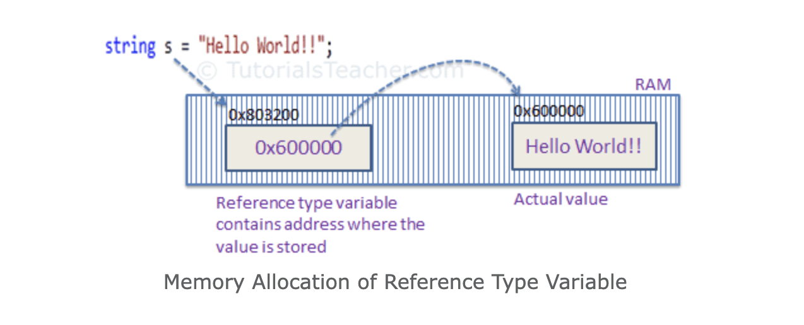
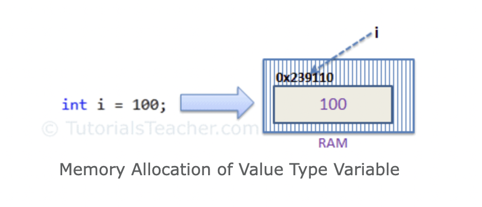

## .NET - C#

> .NET is a software framework that is designed and developed by Microsoft. The first version of the .Net framework was 1.0 which came in the year 2002. In easy words, it is a virtual machine for compiling and executing programs written in different languages like C#, VB.Net, etc.


***

### Content

- [Introduction](#introduction)
- [Compilation Process](#compilation-process)
- [CLR Common Language runtime](#clr-common-language-runtime)
- [MSIL Microsoft Intermediate Language](#msil-microsoft-intermediate-language)
- [Roslyn](#roslyn)
- [GC Garbage Collection](#gc-garbage-collection)
- [CLS Common Language Specification](#cls-common-language-specification)
- [CTS - Common Type System](#cts---common-type-system)
- [BCL The Base Class Library](#bcl-the-base-class-library)
- [FCL Framework Class Library](#fcl-framework-class-library)
- [IDE Integrate Development Environtment](#ide-integrate-development-environtment)
- [donet CLI](#donet-cli)
- [Files Anatomy](#files-anatomy)
- [Compilation Files](#compilation-files)
- [Global JSON file](#global-json-file)
- [NuGet](#nuget)
- [Generic Host](#generic-host)


***

# Introduction

- .NET
    - Create in 2016
    - Open Source
    - Multi-platform

- Documentation: 
  - [dotnet Microsoft](https://docs.microsoft.com/en-us/dotnet/)
  - [dotnet Github](https://github.com/dotnet/core)


- **.NET Framework vs .NET Core**
    1. .NET Framework
        - The first version - 2002
        - Only compatible with windows
        - Intermediate execution platform
        - Designed for corporate apps with traditional architecture
        - Dependent to IDE (Visual Studio) 
    2. .NET Core
        - It is the modern version 
        - Multi-platform (Windows, Linux, MacOS)
        - C#, F#, Visual Basic
        - High-performance oriented and cloud-oriented architectures
        - No dependence on IDE
  
> .NET CORE = .NET

- we can use .NET to create console applications and libraries.
- Windows applications can be created using WinForms, WPF (Windows Presentation Foundation), UWP (Universal Windows Platform) and WinUI3.
- Web Applications & Web API's using ASP.NET
- Mobile applications using Xamarin & NET MAUI.
- Web Applications using Web assembly with BLAZOR.


[Back](#content)

***

# Compilation Process

- Compilation process is done in two parts
  - Firts phase is done by language compilers
  - Second phase is done by JIT

- There are four steps in **code compilation**, which include:
  - Compiling the source code into Managed code by C# compiler.
  - Combining the newly created code into assemblies.
  - Loading the Common Language Runtime(CLR).
  - Executing the assembly by CLR.

How compiler process it works
> In `Asp.net`, you write an page.aspx file that get compiled into a .Net assembly, this assembly is then used by the `Asp.net` runtime that execute http request.


> This .Net assembly can be written in any .Net language like c# or `VB.Net`. But in the end, the code is compiled by the .Net CLR compiler into a Common Intermediary Language(CIL). This CIL is used by the CLR runtime which get loaded when you start a .Net process. The JIT then use this CIL and transform it into pure assembly that will be understandable by the computer.

# CLR Common Language runtime

- The CLR stands for Common Language Runtime and it is an Execution Environment. 
- It works as a layer between Operating Systems and the applications written in .NET languages that conforms to the Common Language Specification (CLS). 
- The main function of Common Language Runtime (CLR) is to convert the Managed Code into native code and then execute the program.

- .NET provides a run-time environment, called the **common language runtime**, that runs the code and provides services that make the development process easier.
- Transforms from Common Intermediate Language (CLI) or MSIL to native code.
- Just in time compiler


- CLR services
  - Assembly Resolver
  - Assembly Loader
  - Type Checker
  - COM marshalled
  - Debug Manager
  - Thread Support
  - IL to Native compiler
  - Exception Manager
  - Garbage Collector

> CoreCLR for .NET Core

- **managed** and **unmanaged** code:
  - Managed code is executed by the Common Language Runtime (CLR) of the .NET Framework, whereas unmanaged code is executed by the Operating System (OS).
  - CLR offers inbuilt security to managed code, whereas it’s the developer’s responsibility to write safe and secure code with unmanaged code.
  - **Managed code** is a code that is executed by the CLR (Common Language Runtime) i.e all application code based on .Net Platform. It is considered as managed because of the .Net framework which internally uses the garbage collector to clear up the unused memory.
  - **Unmanaged code** is any code that is executed by the application runtime of any other framework apart from .Net. The application runtime will take care of memory, security, and other performance operations.


[Back](#content)

# MSIL Microsoft Intermediate Language

- MSIL is the Microsoft Intermediate Language, it provides instructions for calling methods, storing and initializing values, memory handling, exception handling and so on. 
- All the .NET codes are first compiled to Intermediate Language.
- When we compile our .NET code then it is not directly converted to native/binary code; it is first converted into intermediate code known as MSIL code which is then interpreted by the CLR. 
- MSIL is independent of hardware and the operating system. 
- Cross language relationships are possible since MSIL is the same for all .NET languages.
- MSIL is further converted into native code.


[Back](#content)


# Roslyn

- Roslyn is the open-source implementation of both the C# and Visual Basic compilers with an API surface for building code analysis tools.
- It is known as the .NET Compiler Platform
- Features of Roslyn include:
  - Compilers for the C# and Visual Basic languages exposed as services via APIs.
  - APIs for code analysis and refactoring.
- Is integrated by default in Visual studio and dotnet CLI.
- Open Source
- Analyze code style and quality.
- Code Compiled:
  - When a project is developed, C# source code is **compiled** into Intermediate Language (IL). 
  - IL is a set of instructions that produces a machine code for execution on the machine processor. 

In four steps, code moves from the preprocessor to the compiler, to the assembler, and, lastly, to the linker. 

> Compilers build a detailed model of application code as they validate the syntax and semantics of that code.
> They use this model to build the executable output from the source code. The .NET Compiler Platform SDK provides access to this model.

[Back](#content)

# GC Garbage Collection
- Garbage collection is the process of managing memory in an application. 
- The garbage collector automatically disposes of memory that is no longer used to make memory available for new allocations.


[Back](#content)


# CLS Common Language Specification

- It is a set of basic rules and metrics that need to be followed and complied with by .NET compatible languages and then compiled (Roslyn) to another intermediate neutral language called CIL (Common Intermediate Language) where it will finally be translated to the CLR (Common Language Runtime) that will result in an **Assembly language**, machine language.
- The **CLS** ensures complete interoperability between applications, regardless of the language used to create the application.
- Allows to compile high-level languages into a common language CIL (Common Intermediate Language)
- CLS defines a set of features that are needed by many common applications. 
- It also provides a sort of recipe for any language that is implemented on top of .NET on what it needs to support.


> CLS is a subset of the CTS. This means that all of the rules in the CTS also apply to the CLS, unless the CLS rules are more strict. 

[Back](#content)


# CTS - Common Type System

- The Common Type System (CTS) standardizes the data types of all programming languages using .NET under the umbrella of .NET to a common data type for easy and smooth communication among these .NET languages.
- The common type system defines how types are declared, used, and managed in the common language runtime, and is also an important part of the runtime's support for cross-language integration. 
- This is what the Common Type System (CTS) is in charge of doing. It was made to do several things:
    - Establish a framework for cross-language execution.
    - Provide an object-oriented model to support implementing various languages on a .NET implementation.
    - Define a set of rules that all languages must follow when it comes to working with types.
    - Provide a library that contains the basic primitive types that are used in application development (such as, Boolean, Byte, Char etc.)

> Data types are categorized based on how they store their value in the memory.

- CTS defines two main kinds of types that should be supported: **reference** and **value types**

- **Reference Types:**
  - Reference types' objects are represented by a reference to the object's actual value.
  - A reference type doesn't store its value directly. 
  - Instead, it stores the address where the value is being stored. 
  - In other words, a reference type contains a pointer to another memory location that holds the data.
  - For example, consider the following string variable: `string s = "Hello World!!";`
    
    >As you can see in the above image, the system selects a random location in memory (0x803200) for the variable s. The value of a variable s is 0x600000, which is the memory address of the actual data value. Thus, reference type stores the address of the location where the actual value is stored instead of the value itself.


- **Value types:** are the opposite, where the objects are represented by their values. 
  - If you assign a value type to a variable, you are essentially copying a value of the object.
  - A data type is a value type if it holds a data value within its own memory space. 
  - It means the variables of these data types directly contain values.
  - For example, consider integer variable `int i = 100;`
    

| Value Types | Reference Types |
| ----------- | --------------- |
| bool  | String |
| byte  | Arrays (even if their elements are value types) |
| char  | Class |
| decimal | Delegate |
| double  | |
| enum  | |
| float | |
| int | |
| long  | |
| sbyte | |
| short | |
| struct  | |
| uint  | |
| ulong | |
| ushort  | |


> The default value of a **reference type** variable is `null` when they are not initialized. 

> `Null means not refering to any object`.

> A **value type** variable cannot be `null` because it holds value, not a memory address.

- The common type system in .NET supports the following five categories of types:
    - Classes
    - Structures
    - Enumerations
    - Interfaces
    - Delegates


[Back](#content)

# BCL The Base Class Library

- A .NET Framework library, BCL is the standard for the C# runtime library and one of the Common Language Infrastructure (CLI) standard libraries. 
- BCL provides types representing the built-in CLI data types, basic file access, collections, custom attributes, formatting, security attributes, I/O streams, string manipulation, and more.
- The Base Class Library (BCL) is literally that, the base. It contains basic, fundamental types like System.String and System.DateTime.


[Back](#content)

# FCL Framework Class Library

- The .NET Framework class library is exactly what its name suggests: 
  - a library of classes and other types that developers can use to make their lives easier.
  - While these classes are themselves written in C#, they can be used from any CLR based language.
- The Framework Class Library (FCL) is the wider library that contains the totality: 
  - ASP.NET, WinForms, the XML stack, ADO.NET and more. 
  - You could say that the FCL includes the BCL.
> On a simple level, .NET Framework = libraries (FCL, BCL), language compilers (C#, VB.NET) and Common Language Runtime (CLR).


[Back](#content)

# IDE Integrate Development Environtment
- Visual Studio VS
- Visual Studio Code VSC
- Rider (JetBrains)

[Back](#content)

# donet CLI

- Command-line Interface:
  - General: create new Project - create config files  - tools ...
  - Project: restore - compile - excute - clean - test ...
- The .NET command-line interface (CLI) is a cross-platform toolchain for developing, building, running, and publishing .NET applications.
  > CLI command structure consists of the driver ("dotnet"), the command, and possibly command arguments and options. 

  | Basic Commands | Project modification commands | Advanced commands | Tool management commands |
  | -------------- | ----------------------------- | ----------------- | ------------------------ |
  | new            |    add package                | nuget delete      |    tool install          |
  | restore        |    add reference              | nuget locals      |    tool list             |
  | build          |    remove package             | nuget push        |    tool update           |
  | publish        |    remove reference           | msbuild           |    tool restore _Available since .NET Core SDK 3.0._ |
  | run            |    list reference             | dotnet install script  | tool run _Available since .NET Core SDK 3.0._ |
  | test           |                               |                    | tool uninstall    |
  | vstest         |
  | pack           |
  | migrate        |
  | clean          |
  | sln            |
  | help           |
  | store          |

- `dotnet new --list` shows the list of all the templates available to create a .NET application.
- `dotnet watch run` runs the project and checks the changes during execution, it is similar to hot-reload.

[Back](#content)

# Files Anatomy

- Creating console app: `dotnet new console`
     ```   
        myproject/
        ├── bin/
        ├── obj/
        ├── Program.cs
        ├── consoleapp.csproj
    ```
- Creating WEB API app: `dotnet new webapi`
     ```   
        myproject/
        ├── Controlles/
        ├── obj/
        ├── Properties/
        ├── appsettings.Development.json
        ├── appsettings.json
        ├── Program.cs
        ├── WeatherForecast.cs
        ├── webapi.csproj
    ```


[Back](#content)


# Compilation Files

📁⚙ Compilation Files

- Within the compilation process we have two related folders.
  - 📁 bin : Contains the compiled .dll project file and more.
  - 📁 obj : It has the files that are generated in the compilation temporarily, to later be delivered to the bin file.
ㅤ
> 💡 To clean the compilation done, we can use the dotnet clean command

- There are two modes of compilation in .NET:
  - **debug mode**
    - It prepares the application for use in a test environment, it is usually a little heavier than the release compiled mode. It is recommended not to use this compiled in production mode, as it may expose information that we are only interested in displaying when we are testing and not when our clients run it.
ㅤ
  - **release mode**
    - Prepares the application to be production ready, have better performance and performance, as well as being much lighter. Removes all files that are not needed in production.
    - The command that allows us to compile to production is `dotnet build --configuration release`

- Key ideas/concepts:
  - .dll: is a file that comes with a compilation of a high-level language (e.g. C#).
  - .exe: it is an executable file that is only used in Windows, summarizing its operation it takes the .dll file and executes it in our computer.


[Back](#content)

# Global JSON file

- This is a file that allows us to manage the versions of the SDKs we work with in .NET.

- `dotnet new globaljson` this command created the global.json file
  ```json
    {
        "sdk": {
            "allowPrerealese": false,
            "version": "6.0.102"
        }
    }
  ```
- configurations:
  - version: "6.0.102" (always brings the most recent version but we can use and force to some version that we have installed)
  - allowPrerealese: false (enable or disable the use of beta or alpha or test realease to avoid compile failures)

- `donet info` this command shows the list of all SDK versions installed. 
- `donet --version` This command allows you to check the SDK version of the project.

[Back](#content)

# NuGet

- NuGet is the package manager for .NET. The NuGet client tools provide the ability to produce and consume packages. 
- The NuGet Gallery is the central package repository used by all package authors and consumers.
- An essential tool for any modern development platform is a mechanism through which developers can create, share, and consume useful code.
[NuGet.org](https://www.nuget.org/)

> For .NET (including .NET Core), the Microsoft-supported mechanism for sharing code is **NuGet**, which defines how packages for .NET are created, hosted, and consumed, and provides the tools for each of those roles.


[Back](#content)

# Generic Host

- The .NET Generic Host is a feature which sets up some convenient patterns for an application including those for dependency injection (DI), logging, and configuration. 
- It was originally named Web Host and intended for Web scenarios like ASP.NET Core applications but has since been generalized (hence the rename to Generic Host) to support other scenarios, such as Windows services, Linux daemon services, or even a console app.
- A host is an object that encapsulates an app’s resources, such as:
  - Dependency injection (DI)
  - Logging
  - Configuration
  - IHostedService implementations


- Starting with ASP.NET Core 3.0:
  - **IHost:** 
    - The host is the component that hosts and runs your application and its services. 
    - This is a generalization of the previous IWebHost but fullfills basically the same task: 
    - It starts configured hosted services and makes sure that your app is running and working.
  - **IHostBuilder:** 
    - The host builder constructs the host and configures various services. 
    - This is the generalization of the previous IWebHostBuilder but also basically does the same just for generic IHost. 
    - It configures the host before the application starts. 
    - There is the Host.CreateDefaultBuilder method that will set up a host with various defaults, e.g. configuration using appsettings.json and logging.
  - **IHostedService:** 
    - A hosted service is a central component that the host hosts. The most common example would be the ASP.NET Core server, which is implemented as a hosted service on top of the generic host. You can also write your own hosted services, or add third-party services that allow you to nicely add things to your application.
    - Since .NET Core 2.0, the framework provides a new interface named IHostedService helping you to easily implement hosted services. 
    - The basic idea is that you can register multiple background tasks (hosted services) that run in the background while your web host or host is running.
    - Since most background tasks will have similar needs in regard to the cancellation tokens management and other typical operations, there is a convenient abstract base class you can derive from, named BackgroundService (available since .NET Core 2.1).
  
- The generic host introduced with ASP.NET Core 3.0 and .NET Core 3.0 basically replaces the previous IWebHost and IWebHostBuilder. 
- It follows the very same architecture and idea but is simply reduced to non-web tasks so that it can work with a number of different purposes. 
- ASP.NET Core then just builds on top of this generic host.


[Back](#content)


- **SDK:** Software Development Kit is all of the stuff that is needed developing a .NET application easier, such as the CLI and compiler.
- The **runtime:** is the virtual machine that host/runs the application and abstracts all interaction with the base operation system.
- **Domain:** It is an isolation layer provided by the .NET runtime. As such, App domains live with in a process (1 process can have many app domains) and have their own virtual address space.
- **Kestrel** is a cross-platform web server built for ASP.NET Core based on libuv – a cross-platform asynchronous I/O library. It is secure and good enough to use it without a reverse proxy server. However, it is still recommended that you use IIS, Nginx or Apache or something else.
- **Ahead of time (AOT)** delivers faster start-up time, especially in large applications where much code executes on startup. But it requires more disk space and more memory/virtual address space to keep both the IL and precompiled images. In this case the JIT Compiler has to do a lot of disk I/O actions, which are quite expensive.


[Back](#content)

_The End_