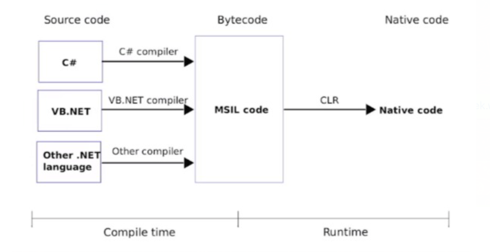
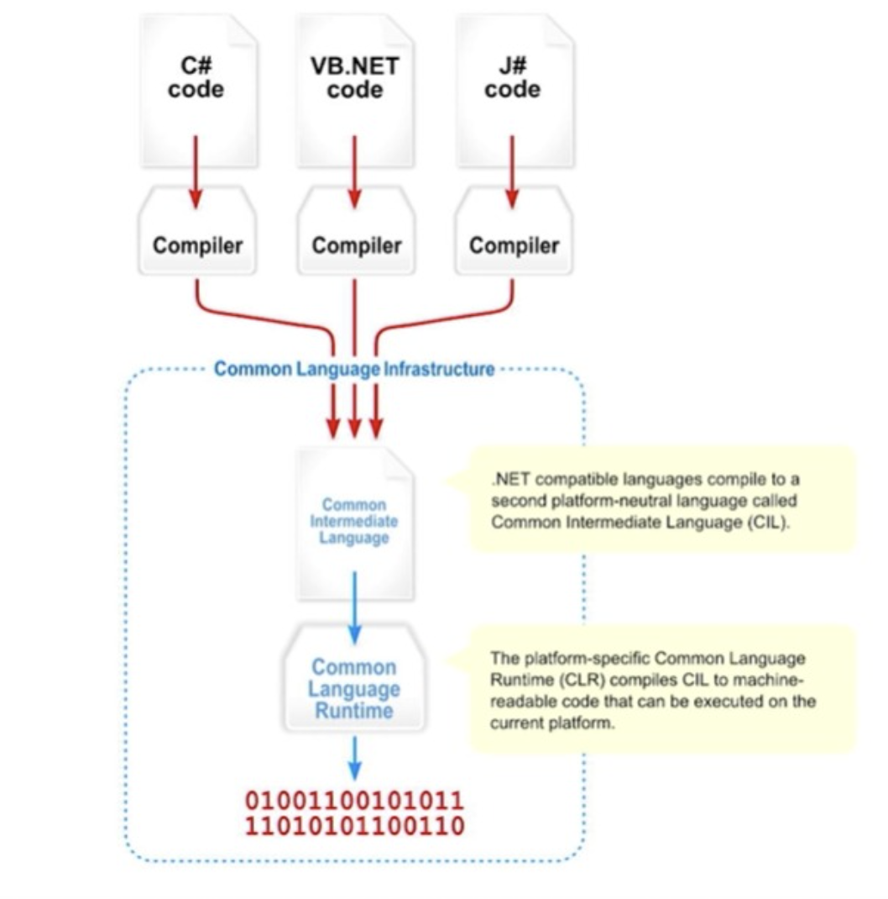

## .NET - C#

> .NET is a software framework that is designed and developed by Microsoft. The first version of the .Net framework was 1.0 which came in the year 2002. In easy words, it is a virtual machine for compiling and executing programs written in different languages like C#, VB.Net, etc.

> C# is a general-purpose, modern and object-oriented programming language pronounced as “C Sharp”. It was developed by Microsoft led by Anders Hejlsberg and his team within the .NET initiative and was approved by the European Computer Manufacturers Association (ECMA) and International Standards Organization (ISO). C# is among the languages for Common Language Infrastructure. C# is a lot similar to Java syntactically and is easy for users who have knowledge of C, C++ or Java.

***

### Content

- [Introduction](#introduction)
- [CLR - Common Language runtime](#clr---common-language-runtime)
- [Roslyn](#roslyn)
- [CLS - Common Language Specification](#cls---common-language-specification)
- [CTS - Common Type System](#cts---common-type-system)
- [IDE - Integrate Development Environtment](#ide---integrate-development-environtment)
- [donet CLI](#donet-cli)

***

# Introduction

- .NET
    - Create in 2016
    - Open Source
    - Multi-platform

- Documentation: 
  - [dotnet Microsoft](https://docs.microsoft.com/en-us/dotnet/)
  - [dotnet Github](https://github.com/dotnet/core)

- **.NET Framework vs .NET Core**
    1. .NET Framework
        - The first version - 2021
        - Only compatible with windows
        - Intermediate execution platform
        - Designed for corporate apps with traditional architecture
        - Dependent to IDE (Visual Studio) 
    2. .NET Core
        - It is the modern version 
        - Multi-platform (Windows, Linux, MacOS)
        - C#, F#, Visual Basic
        - High-performance oriented and cloud-oriented architectures
        - No dependence on IDE
  
> .NET CORE = .NET

- we can use .NET to create console applications and libraries.
- Windows applications can be created using WinForms, WPF (Windows Presentation Foundation), UWP (Universal Windows Platform) and WinUI3.
- Web Applications & Web API's using ASP.NET
- Mobile applications using Xamarin & NET MAUI.
- Web Applications using Web assembly with BLAZOR.

[Back](#content)

***

# CLR - Common Language runtime

- .NET provides a run-time environment, called the **common language runtime**, that runs the code and provides services that make the development process easier.
- Transforms from Common Intermediate Language (CLI) or MSIL to native code.
- Just in time compiler

> CoreCLR for .NET Core

[Back](#content)

# Roslyn

- Roslyn is the open-source implementation of both the C# and Visual Basic compilers with an API surface for building code analysis tools.
- It is known as the .NET Compiler Platform
- Features of Roslyn include:
  - Compilers for the C# and Visual Basic languages exposed as services via APIs.
  - APIs for code analysis and refactoring.
- Is integrated by default in Visual studio and dotnet CLI.
- Open Source
- Analyze code style and quality.

>Compilers build a detailed model of application code as they validate the syntax and semantics of that code. They use this model to build the executable output from the source code. The .NET Compiler Platform SDK provides access to this model.

[Back](#content)

# CLS - Common Language Specification

- It is a set of basic rules and metrics that need to be followed and complied with by .NET compatible languages and then compiled (Roslyn) to another intermediate neutral language called CIL (Common Intermediate Language) where it will finally be translated to the CLR (Common Language Runtime) that will result in an **Assembly language**, machine language.
- The **CLS** ensures complete interoperability between applications, regardless of the language used to create the application.
- Allows to compile high-level languages into a common language CIL (Common Intermediate Language)
- CLS defines a set of features that are needed by many common applications. It also provides a sort of recipe for any language that is implemented on top of .NET on what it needs to support.

> CLS is a subset of the CTS. This means that all of the rules in the CTS also apply to the CLS, unless the CLS rules are more strict. 

[Back](#content)

# CTS - Common Type System

- The common type system defines how types are declared, used, and managed in the common language runtime, and is also an important part of the runtime's support for cross-language integration. 
- This is what the Common Type System (CTS) is in charge of doing. It was made to do several things:
    - Establish a framework for cross-language execution.
    - Provide an object-oriented model to support implementing various languages on a .NET implementation.
    - Define a set of rules that all languages must follow when it comes to working with types.
    - Provide a library that contains the basic primitive types that are used in application development (such as, Boolean, Byte, Char etc.)
- CTS defines two main kinds of types that should be supported: **reference** and **value types**
  - Reference types' objects are represented by a reference to the object's actual value
  - Value types are the opposite, where the objects are represented by their values. If you assign a value type to a variable, you are essentially copying a value of the object.
- The common type system in .NET supports the following five categories of types:
    - Classes
    - Structures
    - Enumerations
    - Interfaces
    - Delegates

[Back](#content)

# IDE - Integrate Development Environtment
- Visual Studio VS
- Visual Studio Code VSC
- Rider (JetBrains)

[Back](#content)

# donet CLI

- Command-line Interface
- The .NET command-line interface (CLI) is a cross-platform toolchain for developing, building, running, and publishing .NET applications.
  
  | Basic Commands | Project modification commands | Advanced commands | Tool management commands |
  | -------------- | ----------------------------- | ----------------- | ------------------------ |
  | new            |    add package                | nuget delete      |    tool install          |
  | restore        |    add reference              | nuget locals      |    tool list             |
  | build          |    remove package             | nuget push        |    tool update           |
  | publish        |    remove reference           | msbuild           |    tool restore Available since .NET Core SDK 3.0. |
  | run            |    list reference             | dotnet install script  | tool run Available since .NET Core SDK 3.0. |
  | test           |                               |                    | tool uninstall    |
  | vstest         |
  | pack           |
  | migrate        |
  | clean          |
  | sln            |
  | help           |
  | store          |

[Back](#content)

- SDK: Software Development Kit