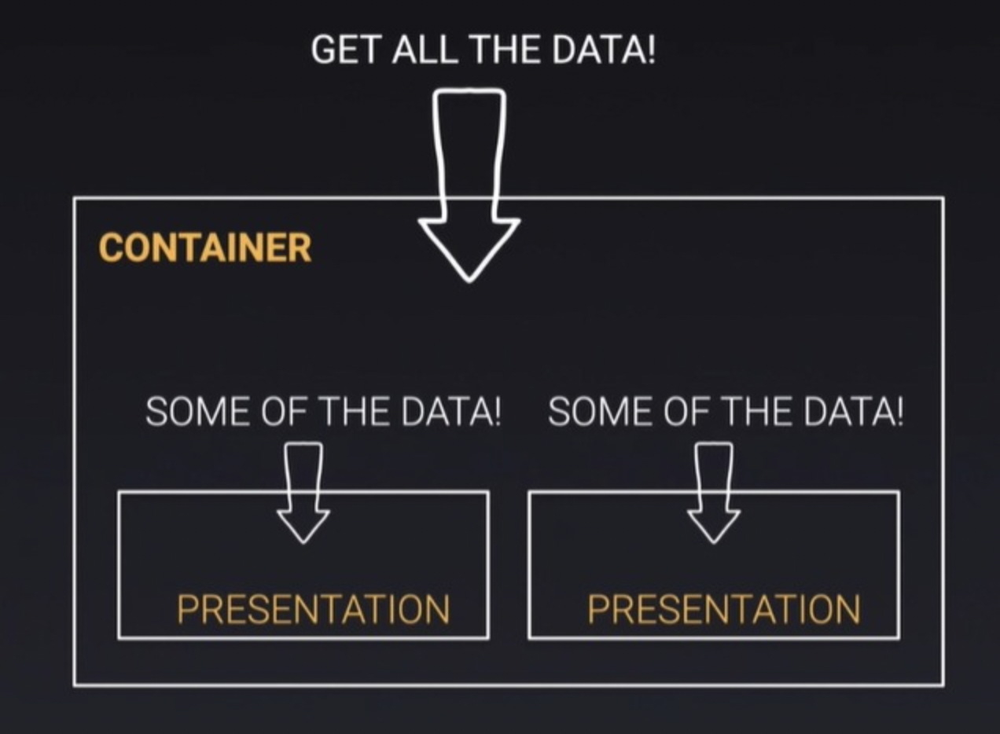
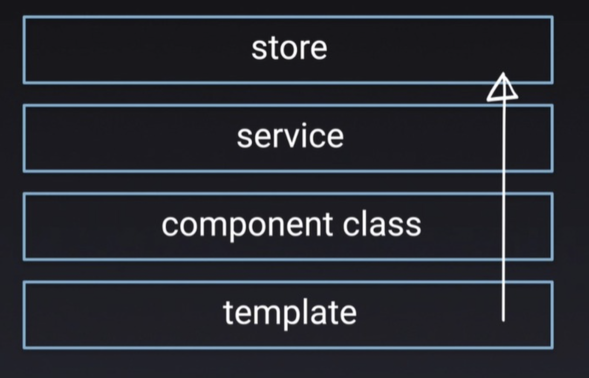
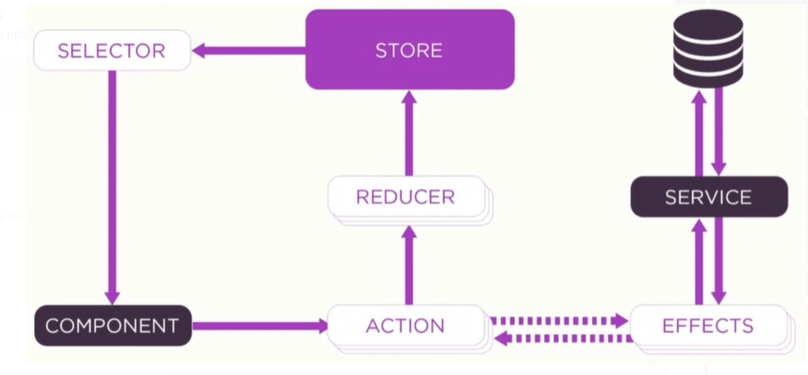

### NGRX
> Reactive State for Angular
***

- **What is NgRx?**
  - NgRx is a framework for building reactive applications in Angular. NgRx provides libraries for:

    - Managing global and local state.
    - Isolation of side effects to promote a cleaner component architecture.
    - Entity collection management.
    - Integration with the Angular Router.
    - Developer tooling that enhances developer experience when building many different types of applications.

- **@ngrx/store**
    - Store is RxJS powered global state management for Angular applications, inspired by Redux. 
    - Store is a controlled state container designed to help write performant, consistent applications on top of Angular.

- **Key concepts**
  - **Actions** describe unique events that are dispatched from components and services.
  - State changes are handled by pure functions called **reducers** that take the current state and the latest action to compute a new state.
  - **Selectors** are pure functions used to select, derive and compose pieces of state.
  - State is accessed with the Store, an observable of state and an observer of actions.

- **Actions**
  - Actions are one of the main building blocks in NgRx. Actions express unique events that happen throughout your application. From user interaction with the page, external interaction through network requests, and direct interaction with device APIs, these and more events are described with actions.

- **Reducers**
    - Reducers in NgRx are responsible for handling transitions from one state to the next state in your application. 
    - Reducer functions handle these transitions by determining which actions to handle based on the action's type.
    - Reducers are pure functions in that they produce the same output for a given input. 
    - They are without side effects and handle each state transition synchronously.

- **Selectors**
    - Selectors are pure functions used for obtaining slices of store state.

- **Effects**
    - In a service-based Angular application, components are responsible for interacting with external resources directly through services. Instead, 
    - effects provide a way to interact with those services and isolate them from the components. 
    - Effects are where you handle tasks such as fetching data, long-running tasks that produce multiple events, and other external interactions where your components don't need explicit knowledge of these interactions.
    - Key Concepts
      - Effects isolate side effects from components, allowing for more pure components that select state and dispatch actions.
      - Effects are long-running services that listen to an observable of every action dispatched from the Store.
      - Effects filter those actions based on the type of action they are interested in. This is done by using an operator.
      - Effects perform tasks, which are synchronous or asynchronous and return a new action.

- **Meta-reducers**
    - @ngrx/store composes your map of reducers into a single reducer.
    - Developers can think of meta-reducers as hooks into the action->reducer pipeline.
    -  Meta-reducers allow developers to pre-process actions before normal reducers are invoked.
    > Meta-reducers in NgRx are similar to middleware used in Redux.

***
# NGRX

- **Introduction**
  - ***Data Binding***
    - we pass data from the class (component.ts file) to the template (component.html file) via **property binding**.
    - we pass events from the template (component.html file) back to the class (component.ts file) via **events binding**.
  
    

  - ***Custom Data Binding***
    - we can find a custom **Input** from this component to another component and also we can listen to a custom **output** from this child component into the parent component.
  
    

    - The parent can send data to the child through the **input** if it has a defined **property**.
    - The child can send **events** back to the parent via **output** so that the parent can then handled that.
    > Data Flow:
    > - **Parent**   [property] IN ---> (event) OUT
    > - **Child**    @Input IN ---> @Output OUT

    
    > Properties/Input data goes down, events/output flow up

  - **States Flow down**  
    - In the container component, we get the data and we feed it into the presentation component. 
    
  - **Events Flow up**  
    - When something happens, the presentation component routes this event, so the container component processes event sends it up. 
    

- **NgRx Flow data**
  - **States flow down** 
    - States flow down from the store to the service(or Facade) into the component class, into the template. 
    
  - **Events flow up** 
    - From the template Events flow up from the template component class into the service (or Facade), and it also could be an effect into the store with store being the single source the truth. 
    
- **NGRX state management Lifecycle**  
  
  - We have the STORE that surfaces data to the component via SELECTOR.
  - A component communicate the event via ACTIONS into the REDUCER, which then modify the state in the STORE.
  - If we need an asynchronous event, it call a SERVICE, then that same object can go to an EFFECT to service, change something and come back.
  > The STORE is ***the single source of truth***.

**NGRX implemeted with Facade**

- **Actions:** 
  - Is nothing more than an Object that has a type and a payload.
  - It doesn't have a Test, because there's nothing to them. 
  - They are data structure.
- **Reducer:**  
  - Listen for an action based on the action type and it performs some operation and return new state. 
- **Selectors:**
  - They are nothing more than really queries. 
  - They are functions that can take other selectors.
  - They return slices of state.
- **Effects:**
  - They are typically where we can put the business logic.
  - They are asynchronous.
  - They use streams to provide new sources of actions to reduce state based on external interactions such as:
    - network requests
    - web socket messages
    - time-based events
- **Facades:** Do two things
  1. Dispatches *Actions*.
  2. Allow to select data from the *Store*. 
- **Adapter:**
  - The adapter is handling the underlying collection.
  - It is implemented in the reducer.

