## Production-Grade Angular 
> Frontend Masters: Lukas Ruebbelke

***

### Content

- [Managing Complexity](#managing-complexity)
- [CLI and Nx Workspaces](#cli-and-nx-workspaces)
- [Boilerplate and Component](#boilerplate-and-component)
- [Complex Workspaces](#complex-workspaces)
- [Mock APIs](#mock-apis)
- [Reactive Angular and State Management](#reactive-angular-and-state-management)
- [Facades](#facades)
- [NGRX](#ngrx)
- [Testing](#testing)
- [Build and Deploy](#build-and-deploy)


***

# Managing Complexity

- **Tips on Managig complexity**
 > MC is the hardest thing about developing software
 - Compexity consists of managing of states, flow control, and code volume.
 - General rules for managing complexity:
   1. There is no language and framework that does everything.
   2. Make it work, make it known make it right and make it fast.  
   3. Code should be fine grained
   4. Code should do one thing
   5. Code should be self documenting
   6. Favor pure, immutable functions
   7. Abstractions should reduce complexity
   8. Abstractions should reduce coupling
   9. Abstractions should increase cohesion
   10. Abstractions should increase portability
   11. Refactor throught promotion
   12. Composition over inheritance
   13. Do not confuse convention for repetition
   14. Well-structured code will naturally have a large surface area
- Team rules for managing complexity
   1. Be mindful over the limitations of your entire team and optimize around that
   2. Favor best practices over introducing idioms however clever they may be
   3. Consistency is better than righteousness
   4. Follow the style guide until it doesn't make sense for your situation
- Tactical rules for managing complexity
   1. Eliminate hidden state in functions
   2. Eliminate nested logic in functions
   3. Do not break the single responsibility principle
   4. Extracting to a method is one of the most effective refactoring strategies available  
   5. If you need to clarify your code with comments then it is probably too complex
> It is impossible to write good tests for bad code.


- **Managing Complexity in Angular**
  - A **Component** should only ever do two things:
    1. Consume just enough data to satisfy its templates.
    2. Capture user events and delegate them upwards
  - Components should be oblivious to business logic, server communication and application state. 
    > Components should be as thin as possible.
   - **Facades** are an effective delegation layer between components and the rest of the app
     > Facades are for delegation only
  - Server communication and state management should be decoupled.
> The litmus test is when the code can be tested and it can be moved. If you can't test it or you can't move it, then you need to refactor.
  

***
> Make it Work

# CLI and Nx Workspaces

- Nx Workspace
    - Nx is a smart, fast and extensible build system with first class monorepo support and powerful integrations.
    - Creating Workspace: `npx create-nx-workspace@latest`   
      - Workspace contains the apps directory with Angular and Nest projects. 
        ```   
         myproject/
           ├── apps/
           ├── libs/
           ├── tools/
           ├── workspace.json
           ├── nx.json
           ├── package.json
           └── tsconfig.base.json
        ```
    - Scripst setting up - package.json
        ```js
          "scripts": {
            "ng": "nx",
            "postinstall": "node ./decorate-angular-cli.js && ngcc --properties es2020 browser module main",
            "start": "nx serve",
            "build": "nx build",
            "test": "nx test",
            "serve:api": "nx run api:serve",
            "serve:web": "ng serve --open",
            "serve:all": "run-p serve:api serve:web"
        },
        ```
    > Using the run-p command to run in parallel. Installing this library `yarn add npm-run-all --dev`.
    - Install Nx CLI: `npm install -g nx`
    - Installing Angular material `nx add @angular/material` & NgRx/store `nx add @ngrx/store@latest`
    - Creating code-data: `nx g lib core-data --parent-module=apps/devnotes/src/app/app.module.ts --routing --style=scss`
      - Select `@nrwl/workspace:library` 
      - Use to comunicate with server
    - Creating code-state: `nx g lib core-state --parent-module=apps/devnotes/src/app/app.module.ts --routing --style=scss`
      - Select `@nrwl/workspace:library` 
      - It responsibles for managing the states of the application 
    - Creating material: `nx g lib material  --parent-module=apps/devnotes/src/app/app.module.ts --routing --style=scss`
      - Select `@nrwl/workspace:library` 
      
    - Creating Service: `nx g s service/flahscards/flashcards --project=core-data` 
    - Creating Routing in Web project: `nx g m routing --flat=true -m=app.module.ts` 
    - Creating Components:
      - Flashcard Components `nx g c flashcards -m app.module.ts --style=scss && nx g c flashcards/flashcards-list -m app.module.ts --style=scss && nx g c flashcards/flashcards-details -m app.module.ts --style=scss`
      - Home Component: `nx g c home -m app.module.ts --style=scss`
***


# Boilerplate and Component
 - for running entire workspace excute `npm run serve:all` command
 - Typical code to edit or create a new record:
  ```js
      saveData(model: Model) {
          if(model.id){
            this.updatedData(model);
          } else {
            this.createData(model);
          }

      }
  ```
  - Adding JSON Server: `yarn add json-server --save-dev` 
    - [json-server tutorial](https://jsonplaceholder.typicode.com/)
    - [json-server references](https://github.com/typicode/json-server)
  - Creating server folder & db json file: `mkdir server && touch server/db.json` with mock data.
    ```js
          {
          "widgets": [{
                  "id": "1",
                  "title": "Remote widget 01",
                  "description": "Pending..."
              },
              {
                  "id": "2",
                  "title": "Remote widget 02",
                  "description": "Pending..."
              },
              {
                  "id": "3",
                  "title": "Remote widget 03",
                  "description": "Pending..."
              }
          ]
        }
    ```
  - Adding new package.json script: 
     ```js
      {
        ...
        "serve:json": "json-server server/db.json",
        ...
      }
     ```
     - running above command we get data from `http://localhost:3000/widgets`
 - Creating the service to start consuming the mock data defined in db.json
    - command to create service in workspace: `nx g s services/widgets/widgets --project=core-data -d` -d dry-run 
      ```js

        const API_ENDPOINT = 'http://localhost:3000'; 
        @Injectable({
          providedIn: 'root'
        })
        export class WidgetsService {

          model = 'widgets';

          constructor(private http: HttpClient) { }

        private getUrl(): string{
          return `${API_ENDPOINT}/${this.model}`;
        }

        private getUrlWithId(id): string {
          return `${this.getUrl()}/${id}`;
        }

        all(): Observable<Widget[]> {
          return this.http.get<Widget[]>(this.getUrl());
        }

        find(id: string): Observable<Widget> {
          return this.http.get<Widget>(this.getUrlWithId(id));
        }

        create(widget: Widget): Observable<Widget> {
          return this.http.post<Widget>(this.getUrl(), widget);
        }

        update(widget: Widget): Observable<Widget> {
          return this.http.put<Widget>(this.getUrlWithId(widget.id), widget);
        }

        delete(widget: Widget): Observable<Widget> {
          return this.http.delete<Widget>(this.getUrlWithId(widget.id));
        }

        }
      ```
    - command to create service in workspace: `nx g s services/items/items --project=core-data -d` -d dry-run 
    - Every time we implement a new service we will use the same methods to fetch data, Now we have two services that contain the same functions, then We should abstract the things that change away from the things that do not change to improve the performance and reusing code.`This is how we can reduce coupling in large scale apps`
 > The business logic around the entities change but the mechanisms to fecht that from REST endpoint doesn't change.
- **Errors Handling:** the best place to catch an error is at the point of origin and some other considerations are what the nature of the error is and whether it requires human intervention. In the context of an Angular application using NgRx errors should be handled at the effects layer.


***

# Complex Workspaces

- **Multiple Apps with Nx Workspace:**
  - Creating new App called client - `nx g app client --linter=tslint --style=scss --routing=false -d` -d run-dry, and then to run we excute `nx run client:serve` command that it raise up the localhost:4200  
  - Adding new script: now the workapace has two applications dashboard and client
  ```js
      {
        ...
      "serve:client": "nx run client:serve --port=4400 --open",
        ...
      }
      > npm run serve:client
  ```
  - Now we can handle two frontend apps (dashboard & client) and also two backend implementations (api & json-server), then we could share live data form json-server to both frontend apps by the service implemented in core-data project.
  > The component layer doesn't need to know the implementation details of where the data is coming from. All it needs to know is that whatever it received it should be renderer.

- **Sharing components through a Lib:**
- The first step is to implement new lib, where we can share the component for all workspace apps.
  - Creating new Lib: `nx g lib ui-toolbar --style=scss -d` 
- And then, Creating new component defined as a toolbar in Lib folder(ui-toolbar project): `nx g c toolbar/toolbar --project=ui-toolbar --style=scss -d` 

- Finally, we could refactor the toolbar component in the dashboard, the idea is to implement a new toolbar in the ui-toolbar project and it renderer on both apps (dashboard & client apps).


***

# Mock APIs

- Nest provides:
  - architecture
  - highly testable
  - scalable
  - loosely coupled
  - easily maintainable

- practice:
  - Adding uuid: `yarn add uuid` 
  - Adding nest mapped types: `yarn add @nestjs/mapped-types` 
    - As you build out features, it's often useful to construct variants on a base entity type. A good example of such a variant is a Data Transfer Object (DTO). A Data Transfer Object is an object that is used to encapsulate data, and send it from one part of your application to another. DTO’s help us define the input and output interfaces of our system.
  - Generating schematics: `nx g @nestjs/schematics:resource widgets --type rest --crud true --source-root apps/api/src -d`
    - the above command generate the REST api.
    - Import the module `WidgetsModule` in app.module.ts file from backend app (api).
    - Finally add this line `app.enableCors();` in main.ts file from api directory to enable CORS validations.
      ```js
        import { Logger } from '@nestjs/common';
        import { NestFactory } from '@nestjs/core';

        import { AppModule } from './app/app.module';

        async function bootstrap() {
          const app = await NestFactory.create(AppModule);
          const globalPrefix = 'api';
          app.enableCors();
          app.setGlobalPrefix(globalPrefix);
          const port = process.env.PORT || 3333;
          await app.listen(port, () => {
            Logger.log('Listening at http://localhost:' + port + '/' + globalPrefix);
          });
        }

        bootstrap();
      ```
- **Adding Swagger**
  
  - The OpenAPI specification is a language-agnostic definition format used to describe RESTful APIs. Nest provides a dedicated module which allows generating such a specification by leveraging decorators. 
  - Installation: To begin using it, we first install the required dependency.
    - execute command: `yarn add @nestjs/swagger swagger-ui-express` 
  - Bootstrap: Once the installation process is complete, open the main.ts file and initialize Swagger using the SwaggerModule class: 
  - If you're using `@nestjs/swagger@5`, then you should upgrade `@nestjs/common` and `@nestjs/core` up on version 8.
  ```js
    ...
    const configureSwagger  = (app) => {
        const options = new DocumentBuilder()
         .setTitle('Production Angular API')
        .setDescription('REST API for the production Angular course')
        .setVersion('1.0')
        .addTag('..Tags')
        .build();
      const document = SwaggerModule.createDocument(app, options);
      SwaggerModule.setup('api', app, document);
    }
    async function bootstrap() {
      const app = await NestFactory.create(AppModule);
      const globalPrefix = 'api';
      app.enableCors();
      app.setGlobalPrefix(globalPrefix);
      configureSwagger(app); // call swagger config
      const port = process.env.PORT || 3333;
      await app.listen(port, () => {
        Logger.log('Listening at http://localhost:' + port + '/' + globalPrefix);
      });
    }

  ```
  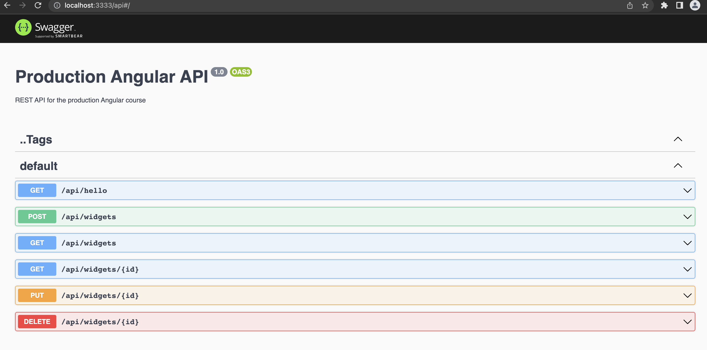
> The OpenAPI Specification (OAS) defines a standard, language-agnostic interface to RESTful APIs which allows both humans and computers to discover and understand the capabilities of the service without access to source code, documentation, or through network traffic inspection. When properly defined, a consumer can understand and interact with the remote service with a minimal amount of implementation logic.

***

# Reactive Angular and State Management

> There are two transitional patterns (The Facade Pattern & a service with a Subject) very useful and they set the stage for doing proper state management in Angular application.
  
  - **The Facade Pattern**
    -  Facades are controversial and can be misused.
    -  Facades are a pure delegation layer and shuold NOT handle business logic.
    -  Facades provide a clean separation between components and te rest of the application.
    -  Just as Input and Output provide an API for your components, Facades provide an API for you application.
    -  Facades are an excellent way to incrementally integrate NgRx.
    -  Facades are great for mocking out a business logic layer.

  - **Reactive Angular, the Facade Pattern, & Subject Pattern**
  - The problem is that the component usually has some knowledge of where the data is coming from and how it's being fetched. so the implementation details are still leaking into the component.
     - The typical component that is injecting a service and it's pulling data, basically it's calling the server into the service into the component. 
     - Being that we have essentially coupled this component to the service. 
     > Intoduce a **Facades** to decouple the component from the implementation details. 
     > - Now we are decoupling or creating abstracting the implementation details from the component
     > - Now we can expose state from the facade directly into the component.
  - Observable stream typically has three events: next(), error, complete()
    - An Observable stream, when we have a subject and we expose the portion that's the observable stream and we call next() on the subject it is going to take that data and it's going to emit it to any subscriber that is subscribed to that stream.
    - Observable stream are very powerful for communicating state or data for one place to another in conjunction with the event that caused it.    
  > Complexity is state management, control flow, and code volume.
***

# Facades

> Facade is a structural *design pattern* that provides a simplified interface to a library, framework or any other complex group of classes.

- **Creating a Facade:**
  - creating facade command: `nx g @nrwl/angular:ngrx widgets --module=libs/core-state/src/lib/core-state.module.ts --directory widgets --defaults --facade`, this command create a  DEFAULT FACADE from ngrx library into core-data folder.
  - > Notice the comments here we have segmented facade state about the data flow. In NgRx state flows down & events(actions) flows up.
  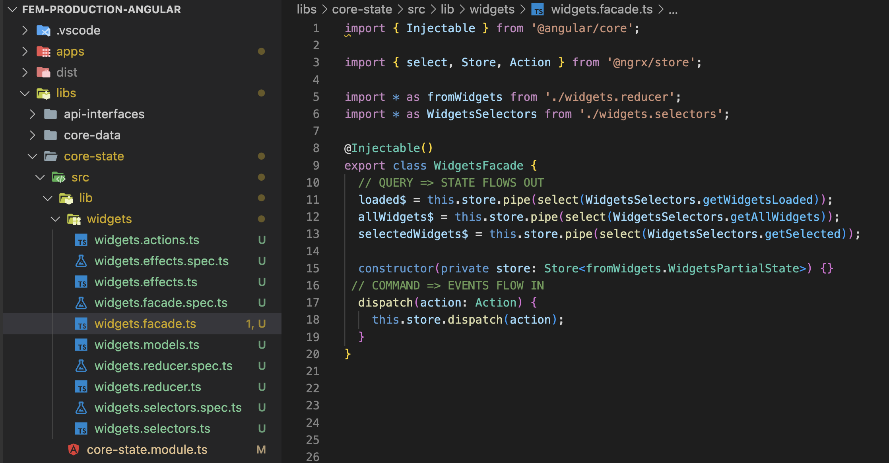
- **Refactoring Default Facade:**
  - We are going to refactor this default facade to implement a service with Subjects: 
    - The subjects have the ability to control flow within observable stream, so if we have any reference to the subject, we can call next() on that subject. 
      1. Define private the subjects. 
      2. Expose the observables. 
    > Segment the subject which is responsible for propagating data from the stream itself. 
    ```js
      
      // imports ...
      
      @Injectable()
      export class WidgetsFacade {

        private allWidgets = new Subject<Widget[]>();
        private selectedWidget = new Subject<Widget>();
        private mutations = new Subject();

        allWidgets$ = this.allWidgets.asObservable();
        selectedWidget$ = this.selectedWidget.asObservable();
        mutations$ = this.mutations.asObservable();

        constructor(private widgetsService: WidgetsService){}

        loadWidgets(){
          this.widgetsService
                    .all()
                    .subscribe((widgets: Widget[]) => this.allWidgets.next(widgets));
        }

        selectWidget(widget: Widget){
          this.selectedWidget.next(widget);
        }


      }  
    ```  


- This is **The typical Component** that is **injecting a service**:
  - > Here we are calling the widgetService, and we are taking that result, and assigning it in a single transaction (Command and a Query together).
  - > This component is coupled to the implementation details.

  ```js

    // imports ...

    const emptyWidget: Widget = {
        id: null,
        title: '',
        description: '',
      };

      @Component({
        selector: 'fem-widgets',
        templateUrl: './widgets.component.html',
        styleUrls: ['./widgets.component.scss'],
      })
      export class WidgetsComponent implements OnInit {
        widgets$: Observable<Widget[]>;
        selectedWidget: Widget;

        constructor(private widgetsService: WidgetsService) {}

        ngOnInit(): void {
          this.reset();
        }

        reset() {
          this.loadWidgets();
          this.selectWidget(null);
        }

        resetForm() {
          this.selectedWidget = emptyWidget;
        }

        selectWidget(widget: Widget) {
          this.selectedWidget = widget;
        }

        loadWidgets() {
          this.widgets$ = this.widgetsService.all();// COMMAND + QUERY
        }

        saveWidget(widget: Widget) {
          if (widget.id) {
            this.updateWidget(widget);
          } else {
            this.createWidget(widget);
          }
        }

        createWidget(widget: Widget) {
          // COMMAND + QUERY
          this.widgetsService.create(widget).subscribe((result) => this.reset());
        }

        updateWidget(widget: Widget) {
          // COMMAND + QUERY
          this.widgetsService.update(widget).subscribe((result) => this.reset());
        }

        deleteWidget(widget: Widget) {
          // COMMAND + QUERY
          this.widgetsService.delete(widget).subscribe((result) => this.reset());
        }
      }

  ```
- This is **The Reactive Component** with **the FACADE pattern injected**:
  - > Now we have removed all the implementation details around state management out of the component.
  - > Command and a Query are separated.
  ```js
      // imports ...

    const emptyWidget: Widget = {
      id: null,
      title: '',
      description: '',
    };

    @Component({
      selector: 'fem-widgets',
      templateUrl: './widgets.component.html',
      styleUrls: ['./widgets.component.scss'],
    })
    export class WidgetsComponent implements OnInit {

      // Instantiating the observables defined in the facade
      // ... and these Obs$ are redered in the component by Async PIPE
      widgets$: Observable<Widget[]> = this.widgetsFacade.allWidgets$; // QUERY
      selectedWidget$: Observable<Widget> = this.widgetsFacade.selectedWidget$; // QUERY

      // Injected Facade service
      constructor(private widgetsFacade: WidgetsFacade) {}

      ngOnInit(): void {
        this.reset();
      }

      reset() {
        this.loadWidgets();
        this.selectWidget(null);
      }

      resetForm() {
        this.selectWidget(emptyWidget);
      }

      selectWidget(widget: Widget) {
        this.widgetsFacade.selectWidget(widget);// COMMAND
      }

      loadWidgets() {
        this.widgetsFacade.loadWidgets();// COMMAND
      }

      saveWidget(widget: Widget) {
        if (widget.id) {
          this.updateWidget(widget);
        } else {
          this.createWidget(widget);
        }
      }

      createWidget(widget: Widget) {
        //this.widgetsService.create(widget).subscribe((result) => this.reset());
      }

      updateWidget(widget: Widget) {
        //this.widgetsService.update(widget).subscribe((result) => this.reset());
      }

      deleteWidget(widget: Widget) {
        //this.widgetsService.delete(widget).subscribe((result) => this.reset());
      }
    }

  ```
***

# NGRX

- **Introduction**
  - ***Data Binding***
    - we pass data from the class (component.ts file) to the template (component.html file) via **property binding**.
    - we pass events from the template (component.html file) back to the class (component.ts file) via **events binding**.
  
    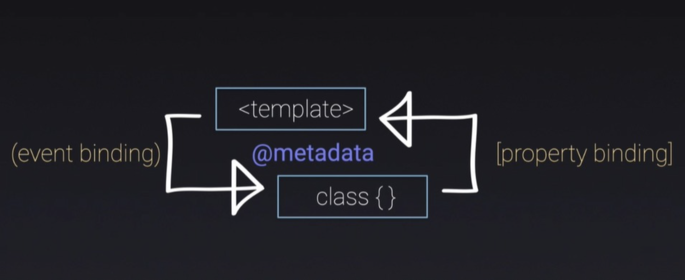

  - ***Custom Data Binding***
    - we can find a custom **Input** from this component to another component and also we can listen to a custom **output** from this child component into the parent component.
  
    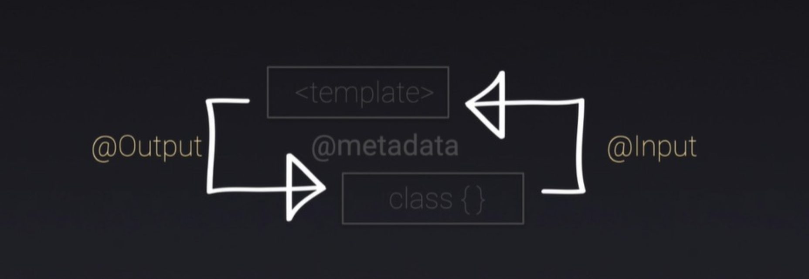

    - The parent can send data to the child through the **input** if it has a defined **property**.
    - The child can send **events** back to the parent via **output** so that the parent can then handled that.
    > Data Flow:
    > - **Parent**   [property] IN ---> (event) OUT
    > - **Child**    @Input IN ---> @Output OUT

    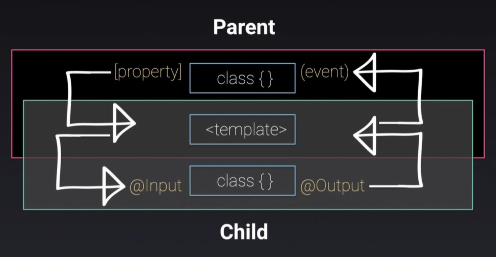
    > Properties/Input data goes down, events/output flow up

  - **States Flow down**  
    - In the container component, we get the data and we feed it into the presentation component. 
    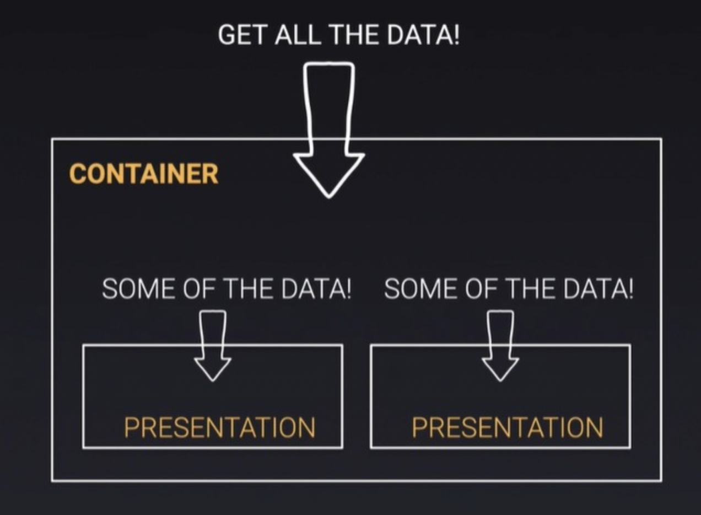
  - **Events Flow up**  
    - When something happens, the presentation component routes this event, so the container component processes event sends it up. 
    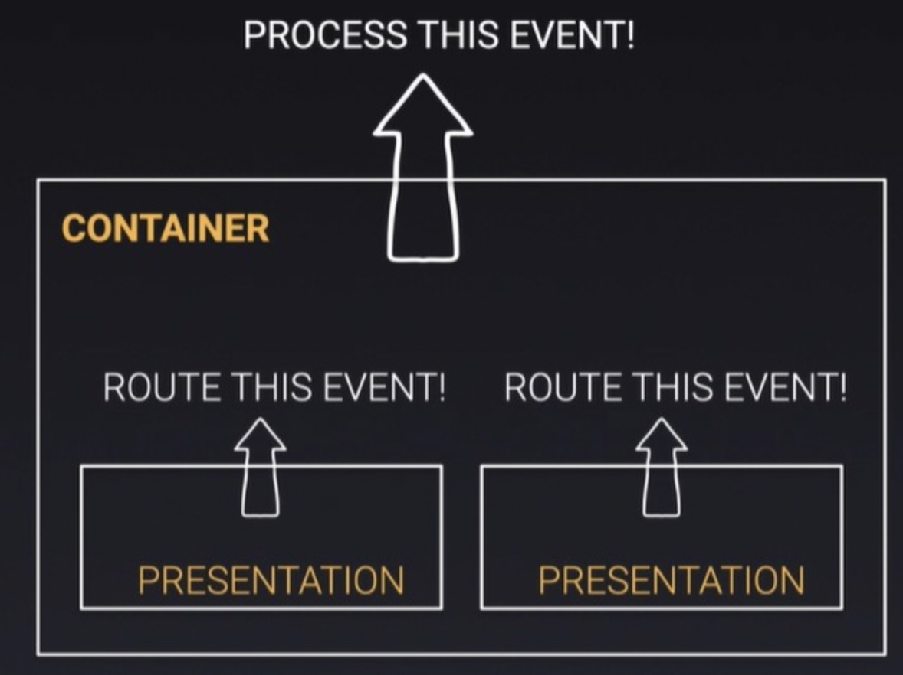

- **NgRx Flow data**
  - **States flow down** 
    - States flow down from the store to the service(or Facade) into the component class, into the template. 
    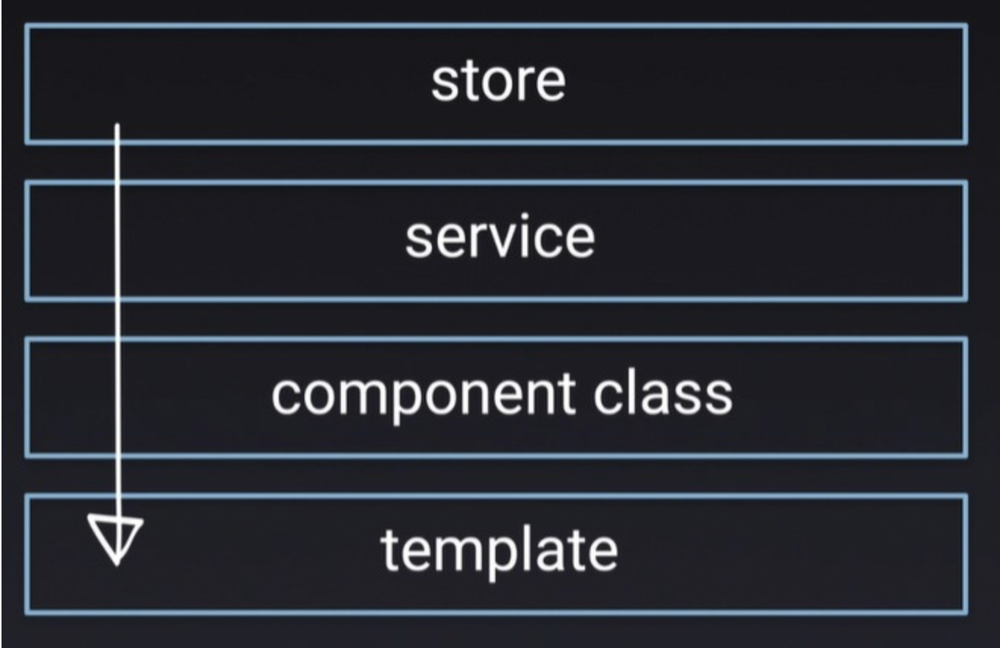
  - **Events flow up** 
    - From the template Events flow up from the template component class into the service (or Facade), and it also could be an effect into the store with store being the single source the truth. 
    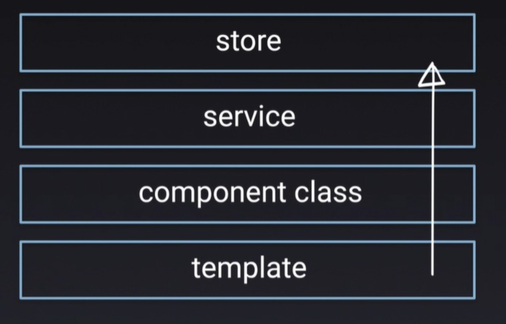
- **NGRX state management Lifecycle**  
  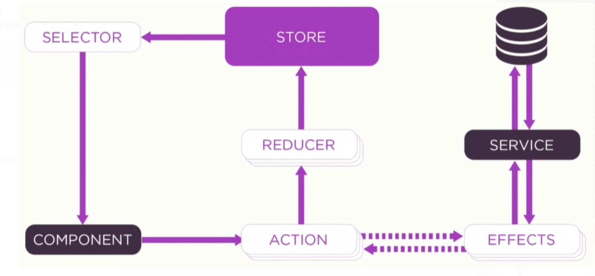
  - We have the STORE that surfaces data to the component via SELECTOR.
  - A component communicate the event via ACTIONS into the REDUCER, which then modify the state in the STORE.
  - If we need an asynchronous event, it call a SERVICE, then that same object can go to an EFFECT to service, change something and come back.
  > The STORE is ***the single source of truth***.


**NGRX implemeted with Facade**

- **Actions:** 
  - Is nothing more than an Object that has a type and a payload.
  - It doesn't have a Test, because there's nothing to them. 
  - They are data structure.
- **Reducer:**  
  - Listen for an action based on the action type and it performs some operation and return new state. 
- **Selectors:**
  - They are nothing more than really queries. 
  - They are functions that can take other selectors.
  - They return slices of state.
- **Effects:**
  - They are typically where we can put the business logic.
  - They are asynchronous.
  - They use streams to provide new sources of actions to reduce state based on external interactions such as:
    - network requests
    - web socket messages
    - time-based events
- **Facades:** Do two things
  1. Dispatches *Actions*.
  2. Allow to select data from the *Store*. 
- **Adapter:**
  - The adapter is handling the underlying collection.
  - It is implemented in the reducer.


***
> Make it Right

# Testing

> It is impossible to write good test for bad code.

- We test only what that function does.
- If we want to get good at testing, focus on writing good code:
  - Very small.
  - Granular.
  - Single purpose functions.
  - Only test what that method does.

- The Reactive Component file:
  ```js

      // ...imports

      @Component({
        selector: 'fem-widgets',
        templateUrl: './widgets.component.html',
        styleUrls: ['./widgets.component.scss'],
      })
      export class WidgetsComponent implements OnInit {
        allWidgets$: Observable<Widget[]> = this.widgetsFacade.allWidgets$;
        selectedWidget$: Observable<Widget> = this.widgetsFacade.selectedWidget$;

        constructor(private widgetsFacade: WidgetsFacade) {}

        ngOnInit(): void {
          this.reset();
          this.widgetsFacade.mutations$.subscribe((_) => this.reset())
        }

        reset() {
          this.loadWidgets();
          this.selectWidget(null);
        }

        resetForm() {
          this.selectWidget(null);
        }

        selectWidget(widget: Widget) {
          this.widgetsFacade.selectWidget(widget?.id);
        }

        loadWidgets() {
          this.widgetsFacade.loadWidgets();
        }

        saveWidget(widget: Widget) {
          this.widgetsFacade.saveWidget(widget);
        }

        deleteWidget(widget: Widget) {
          this.widgetsFacade.deleteWidget(widget);
        }
      }
  ```
- The Reactive Component test file:
```js

    // ...imports

    describe('WidgetsComponent', () => {
      let component: WidgetsComponent;
      let fixture: ComponentFixture<WidgetsComponent>;
      let de: DebugElement;
      let widgetsFacade: WidgetsFacade;

      beforeEach(async () => {
        await TestBed.configureTestingModule({
          declarations: [
            WidgetsComponent,
            WidgetDetailsComponent,
            WidgetsListComponent,
          ],
          imports: [
            CoreDataModule,
            CoreStateModule,
            FormsModule,
            MaterialModule,
            HttpClientTestingModule,
            NoopAnimationsModule,
            RouterTestingModule,
          ],
          providers: [
            { provide: WidgetsFacade, useValue: mockWidgetsFacade },
          ]
        })
        .compileComponents();
      });

      beforeEach(() => {
        fixture = TestBed.createComponent(WidgetsComponent);
        component = fixture.componentInstance;
        de = fixture.debugElement;
        widgetsFacade = TestBed.inject(WidgetsFacade);
        fixture.detectChanges();
      });

      it('should create', () => {
        expect(component).toBeTruthy();
      });

      it('should on select call widgetsFacade selectWidget', () => {
        const spy = jest.spyOn(widgetsFacade, 'selectWidget');

        component.selectWidget(mockWidget);

        expect(spy).toHaveBeenCalledWith(mockWidget.id);
      });

      describe('should on save call widgetsFacade', () => {
        it('updateWidget', () => {
          const spy = jest.spyOn(widgetsFacade, 'saveWidget');

          component.saveWidget(mockWidget);

          expect(spy).toHaveBeenCalledWith(mockWidget);
        });

        it('createWidget', () => {
          const spy = jest.spyOn(widgetsFacade, 'saveWidget');

          component.saveWidget(mockEmptyWidget);

          expect(spy).toHaveBeenCalledWith(mockEmptyWidget);
        });
      });

      it('should on delete call widgetsFacade deleteWidget', () => {
        const spy = jest.spyOn(widgetsFacade, 'deleteWidget');

        component.deleteWidget(mockWidget);

        expect(spy).toHaveBeenCalledWith(mockWidget);
      });
    });

```

- **Code Coverage**
  - For running test in a specific app into monorepo: `nx run dashborad:test`, this command runs the tests for the dashboard app. 
  - For running test with code coverage info: `nx run dashborad:test --code-coverage`. 
  - For getting a quick CLI test result, we could add this line `coverageReporters: ['text']` into the jest.config.js file from each root app folder.

- **End to End**
  - The e2e tests are the most underrated most high-value activities that organizations can do.
  - **Cypress**: 
    - Cypress was originally designed to run end-to-end (E2E) tests on anything that runs in a browser. A typical E2E test visits the application in a browser and performs actions via the UI just like a real user would. 
    - Running cypress in Nx monorepo: `nx run dashboard-e2e:e2e --watch` 
    - The image below shows the scaffolding of a cypress project y the file where the mock data could be built.
     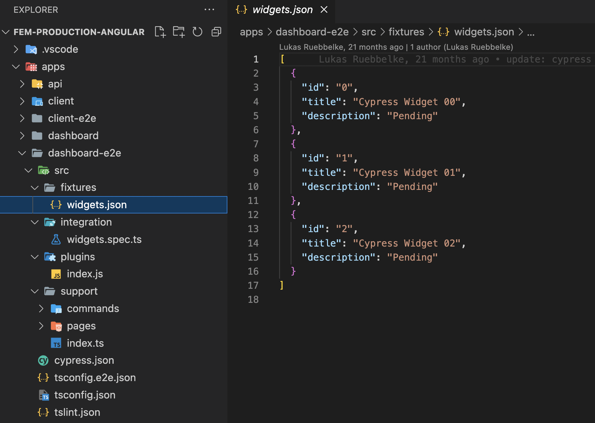

    - **Structuring the test:** 
      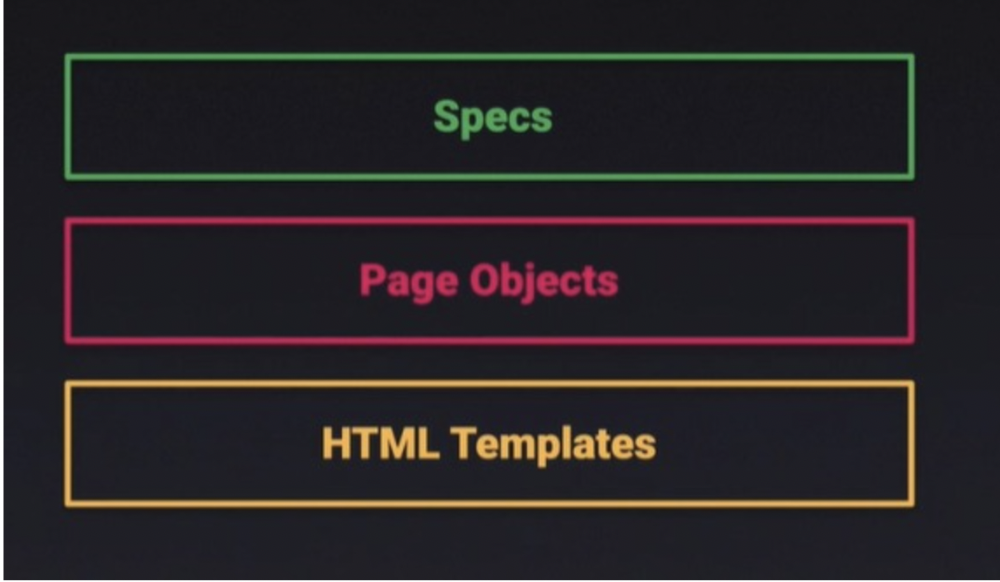
      - ***Specs:*** 
        - What we expect to happen broken down into individuals tests.
      - ***Page Objects:*** 
        - They are responsible for managing and sequencing the interaction of elements on the page.
        - A simple key value object that helps locate elements on the page.
      - ***HTML Templates:*** 
        - We instrument our HTML templates with data test IDs fro easys selection.
        - This is what we use to allow Cypress to then query our application an get access to it.

    - Test suite widget.spec.ts file: 
  ```js
      import {
      clearForm,
      createWidget,
      deleteWidget,
      getWidgetDetailsTitle,
      getWidgetItem,
      getWidgets,
      selectWidget,
      state,
      updateWidget
    } from '../support/pages/widgets.po';

    describe('Widgets', () => {
      const model = 'widgets';
      let widgets = null;

      before(() => {
        cy.fixture('widgets').then((json) => (widgets = json));
        cy.loadData(['widgets']);
        cy.visit(state.route);
      });

      it('should be on the widgets page', () => {
        cy.checkLocation(state.route);
      });

      it('should list all widgets', () => {
        getWidgets().should('have.length', widgets.length);
      });

      it('should create a widget', () => {
        createWidget(model, state.newMockWidget);
        getWidgetItem(state.newMockWidget).should('exist');
      });

      it('should display a selected widget details', () => {
        clearForm();
        selectWidget(state.newMockWidget);
        getWidgetDetailsTitle().should('contain.text', `Editing ${state.newMockWidget.title}`);
      });

      it('should clear widget details the form on cancel', () => {
        selectWidget(state.newMockWidget);
        clearForm();
        getWidgetDetailsTitle().should('contain.text', `Select Widget`);
      });

      it('should update a widget', () => {
        selectWidget(state.updatedMockWidget);
        updateWidget(model, state.updatedMockWidget);
        getWidgetItem(state.updatedMockWidget).should('exist');
      });

      it('should delete a widget', () => {
        deleteWidget(model, state.updatedMockWidget);
        getWidgetItem(state.updatedMockWidget).should('not.exist');
        getWidgets().should('have.length', widgets.length);
      });
    });

  ```

- ***Commands Folder:***
  - Cypress comes with its own API for creating custom commands and overwriting existing commands. 
  - The functions implemented in `commands.ts`(path: src/supports/commands/commands.ts) make it possible to consume the API enpoints. 
  ```js
    declare namespace Cypress {
      interface Chainable<Subject> {
        loadData(models: string[]): void;
        checkLocation(path: string): void;
        getEntities(model: string): void;
        createEntity(model: string, mock: any): void;
        updateEntity(model: string, mock: any): void;
        deleteEntity(model: string, mock: any): void;
        addEntity(model: string, mock: any): void;
      }
    }

    const API_URL = Cypress.env('apiUrl') ;

    Cypress.Commands.add('checkLocation', (route) => {
      cy.location('pathname').should('equal', route);
    });

    Cypress.Commands.add('loadData', (models: string[]) => {
      models.forEach(model =>  cy.getEntities(model));
    });

    Cypress.Commands.add('getEntities', (model) => {
      cy.server();
      cy.route('GET', `${API_URL}/${model}`, `fixture:${model}`);
    });

    Cypress.Commands.add('createEntity', (model, entity) => {
      cy.server();
      cy.route('POST', `${API_URL}/${model}`, { entity });
      cy.addEntity(model, entity);
    });

    Cypress.Commands.add('updateEntity', (model, entity) => {
      cy.server();
      cy.route('PUT', `${API_URL}/${model}/${entity.id}`, { entity });
      cy.addEntity(model, entity);
    });

    Cypress.Commands.add('deleteEntity', (model, entity) => {
      cy.server();
      cy.route('DELETE', `${API_URL}/${model}/${entity.id}`, { entity });
      cy.getEntities(model);
    });

    Cypress.Commands.add('addEntity', (model, mock) => {
      cy.server();
      cy.fixture(model).then((collection)  => {
        cy.route('GET', `${API_URL}/${model}`, [...collection, mock]).as(model);
      });
    });

  ```
- ***Pages Folder:***
  - The contanst implemented in `widget.po.ts`(path: src/supports/pages/widget.po.ts) allow to easily identify and select DOM elements, they must have the following property implemented: 
  - For instance, in this widget-list.component.html file some elements have this property `data-cy="widgets-list"`, so it is necessary that cypress build identify this selector.
  - Events can also be triggered .
  ```html
    <mat-card>
    <mat-card-title>
      Widgets
    </mat-card-title>
    <mat-card-content>
      <mat-list data-cy="widgets-list">
        <mat-list-item *ngFor="let widget of widgets"
          attr.data-cy="widget-{{ widget.id }}-item"
          class="mat-list-option"
          (click)="selected.emit(widget)">
          <span matLine attr.data-cy="widget-{{ widget.id }}-item-title">{{ widget.title }}</span>
          <button *ngIf="!readonly"
            attr.data-cy="delete-widget-{{ widget.id }}-btn"
            mat-icon-button
            type="button"
            color="warn"
            (click)="deleted.emit(widget); $event.stopImmediatePropagation()">
            <mat-icon>clear</mat-icon>
          </button>
        </mat-list-item>
      </mat-list>
    </mat-card-content>
  </mat-card>
  ```

  ```js
    //**************************************
    // This file instantiates the DOM selectors that have an 
    // identifier defined by means of the property data-cy 
    // into HTML component file.
    // Events can also be triggered 
    //************************************** 
    export const state = {
      route: '/widgets',
      homeRoute: '/',
      newMockWidget: {
        id: 'E2E_WIDGET_ID',
        title: 'E2E Mock Widget',
        description: 'E2E Mock Description',
      },
      updatedMockWidget: {
        id: 'E2E_WIDGET_ID',
        title: 'E2E Mock Widget!!',
        description: 'E2E Mock Description Updated',
      }
    };

    export const getWidgetsList = () => cy.get('[data-cy=widgets-list]');

    export const getWidgets = () => cy.get('[data-cy=widgets-list]>mat-list-item');

    export const getWidgetItem = (widget) => cy.get(`[data-cy=widget-${widget.id}-item]`);

    export const getWidgetTitle = (widget) => cy.get(`[data-cy=widget-${widget.id}-item-title]`);

    export const getWidgetDeleteBtn = (widget) => cy.get(`[data-cy=delete-widget-${widget.id}-btn]`);

    export const getWidgetDetailsTitle = () => cy.get('[data-cy=widget-details-title]');

    export const selectWidget = (widget) => getWidgetItem(widget).click();

    export const clearForm = () => cy.get('[data-cy=widget-form-cancel]').click();

    export const completeNewWidgetForm = (widget) => {
      cy.get(`[data-cy=widget-form-title]`).type(widget.title, { delay: 20});
      cy.get(`[data-cy=widget-form-description]`).type(widget.description, { delay: 20});
      cy.get('[data-cy=widget-form-save]').click();
    };

    export const completeUpdateWidgetForm = (widget) => {
      cy.get(`[data-cy=widget-form-title]`).clear().type(`${widget.title}!!`, { delay: 20});
      cy.get(`[data-cy=widget-form-description]`).clear().type(`${widget.description} updated`, { delay: 20});
      cy.get('[data-cy=widget-form-save]').click();
    };

    export const createWidget = (model, widget) => {
      cy.createEntity(model, widget);
      completeNewWidgetForm(widget);
    };

    export const updateWidget = (model, widget) => {
      cy.updateEntity(model, widget);
      completeUpdateWidgetForm(widget);
    };

    export const deleteWidget = (model, widget) => {
      cy.deleteEntity(model, widget);
      getWidgetDeleteBtn(widget).click();
    };

    export const checkWidgetDetailsTitle = (title) => {
      getWidgetDetailsTitle().should('contain.text', title);
    };

    export const checkWidgetsLength = (widgets) => {
      getWidgets().should('have.length', widgets.length);
    };

    export const checkWidget = (widget, exists = true) => {
      const condition = exists ? 'exist' : 'not.exist';
      getWidgetItem(widget).should(condition);
    };

  ```
***
> Make it Fast

# Build and Deploy
- Techniques use for analyzing:
  1. Footpring our application with **Bundle Analyzer** 
    - Install `yarn add webpack-bundle-analyzer --save-dev`
    - Add Scripts into package.json file:
      ```js
        "builds:stats": "ng duild --stats-json",
        "analyze": "webpack-bundle-analyzer dist/apps/dashboards/stats.json",
      ```
    - The first script export a JSON file with the stats about the build, and the second one runs the analyzer to point to the stats JSON file.
    - Executing scripts: 
      - `npm run build:stats` once this command was run make sure that the stats.json file was created in the root app folder.
      - `npm run analyze` when this has done, the Webpack Bundle Analizer is started at http://localhost:8888 and generate this particular view: 
      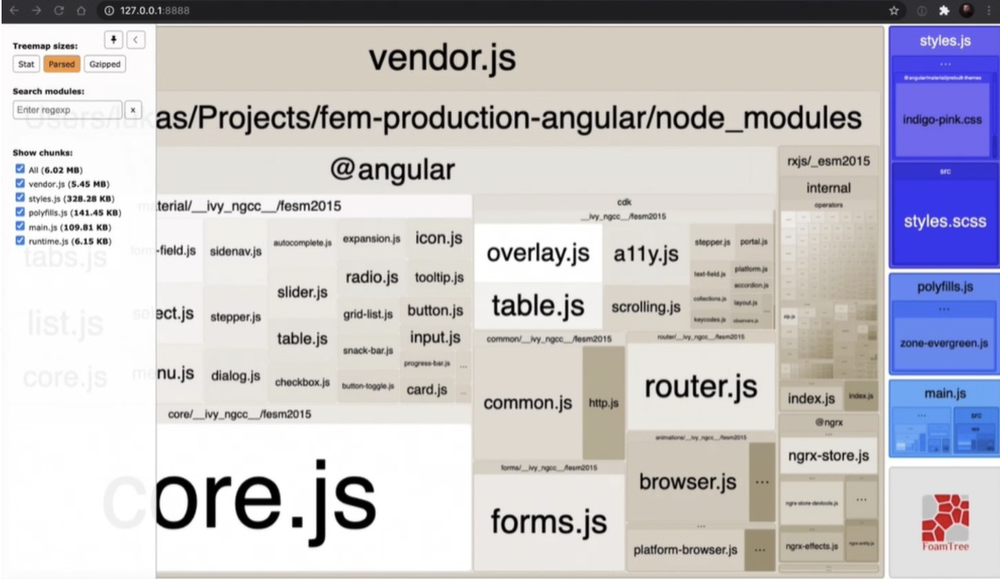

      > This analyzer shows the chunk's weight of the entire application, also we can get a wide view of angular material components, so we could consider which of them are not using.
    2. Graph Analyze:
      - Running `nx dep-graph --file=output.html`, once this command was run, it created some files into the root of app:
        - output.html
        - dep-graph.css
        - dep-graph.js
        - vendor.js
      - Open the Graph (output.html), this allows to visualize the independency graph that exists within our monorepo project.
    - 
      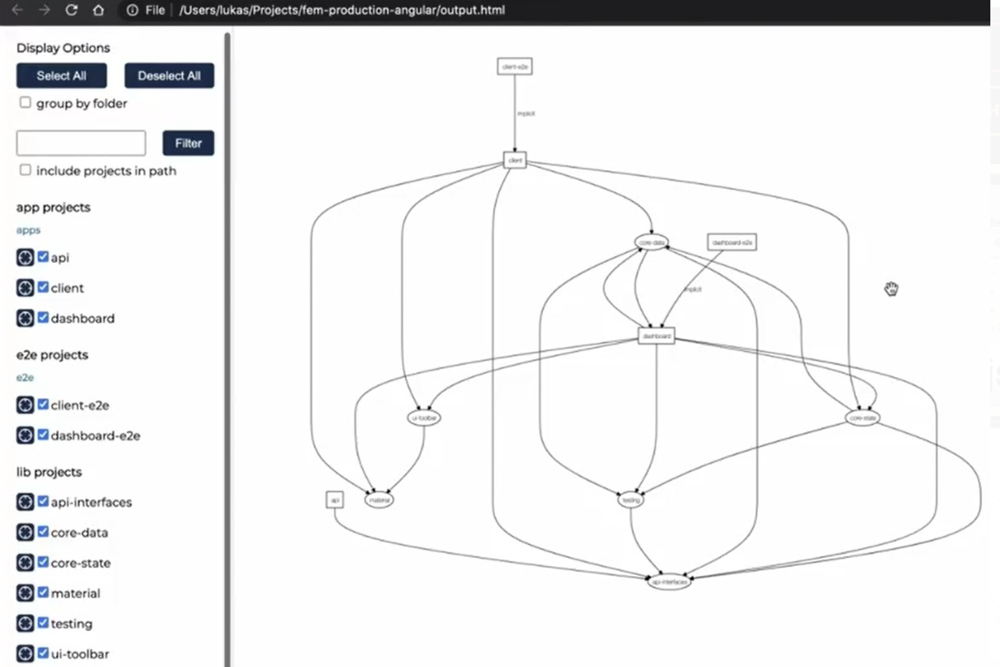


      > The graph is a really good way to start to analyze dependencies and how everything is connected.

- Technique to reduce app weight:   
  - Running this command: `nx run dashboard:build --prod` or `ng build --prod` in an Angular application reduces significantly the weight of production files.
  - The use of this flag `--prod` may throw an error if the environment files are not properly configured.
    
- Deploy tools:
  - ***Vercel:*** Vercel is a platform for frontend frameworks and static sites, built to integrate with your headless content, commerce, or database. [vercel.com](https://vercel.com/).
  - ***Docker:*** Docker is an open platform for developing, shipping, and running applications. Docker enables you to separate your applications from your infrastructure so you can deliver software quickly.  [docker.com](https://www.docker.com/).


_The End_