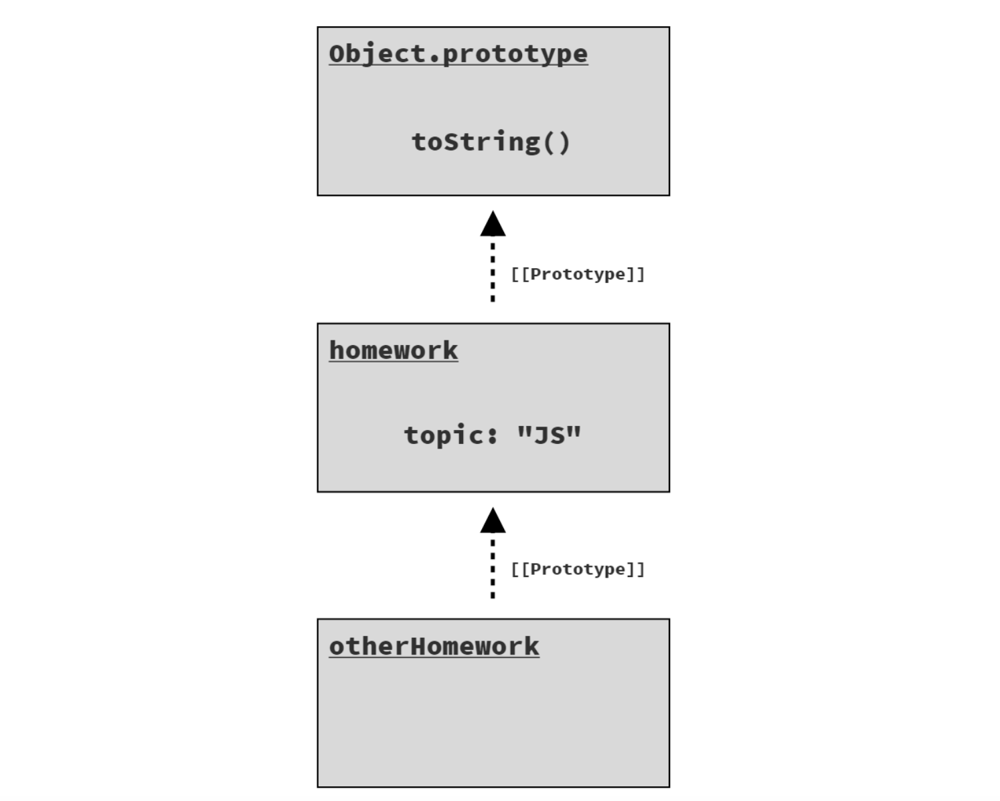
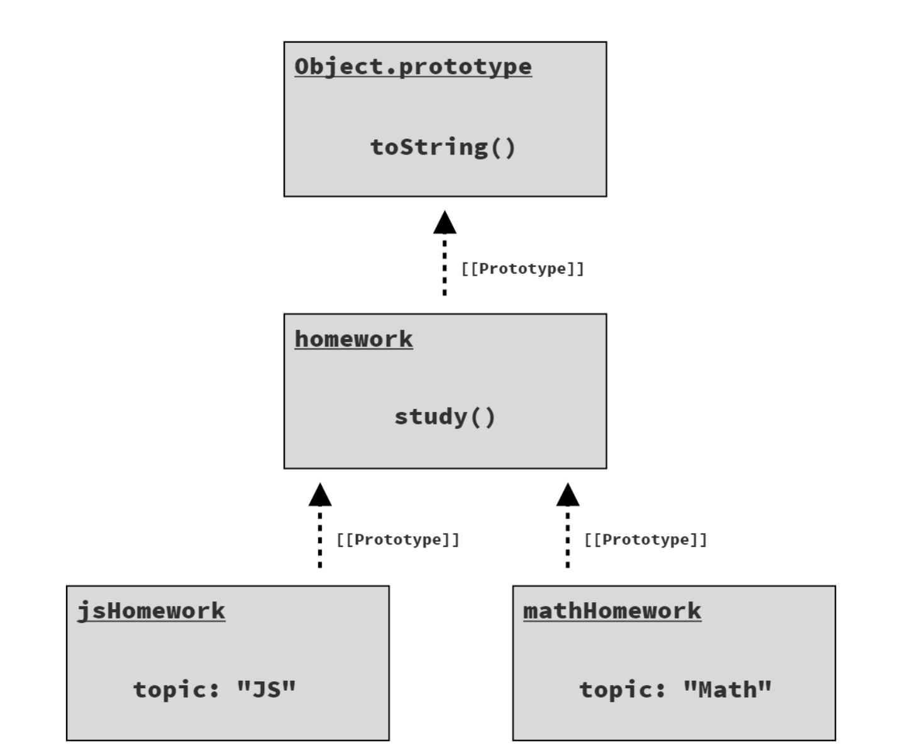

## You Don’t Know JS Yet: Get Started 

### Chapter 3: Digging tothe Roots of JS
***

**Iteration**
- The iterator pattern defines a data structure called an “iterator” that has a reference to an underlying data source (like the query result rows), which exposes a method like next(). Calling next() returns the next piece of data.
- The importance of the iterator pattern is in adhering to a standard way of processing data iteratively, which creates cleaner and easier to understand code, as opposed to having every data structure/source define its own custom way of handling its data.
> ES6 standardized a specific protocol for the iterator pattern directly in the language. The protocol defines a next() method whose return is an object called an iterator result ; the object has value and done properties, where done is a boolean that is false until the iteration over the underlying data source is complete.

**Consuming Iterators**

ES6 included several mechanisms (syntax and APIs) for standardized consumption of these iterators.
- The for..of loop:
    ```ruby
    // given an iterator of some data source:
    var it = /* .. */;
    // loop over its results one at a time
    for (let val of it) {
    console.log(`Iterator value: ${ val }`);
    }
    // Iterator value: ..
    // Iterator value: ..
    // ..
    ```
 - The ... operator: 
  This operator actually has two symmetrical forms: spread and rest. 
  The spread form is an iterator-consumer.
    An array spread:

    ```
    // spread an iterator into an array,
    // with each iterated value occupying 
    // an array element position.
    var vals = [ ...it ];
    ```

    A function call spread:

    ```
    // spread an iterator into a function,
    // call with each iterated value
    // occupying an argument position.
    doSomethingUseful( ...it );
    ```
> In both cases, the iterator-spread form of ... follows the iterator-consumption protocol (the same as the for..of loop) to retrieve all available values from an iterator and place (aka, spread) them into the receiving context (array, argument list).
      
**Iterables**

- ES6 defined the basic data structure/collection types in JS as iterables. This includes strings, arrays, maps, sets, and others.
    ```ruby
    // an array is an iterable
    var arr = [ 10, 20, 30 ];
    ```
- Since arrays are iterables, we can shallow-copy an array using iterator consumption via the ... spread operator:
    ```ruby
    var arrCopy = [ ...arr ];
    ```

- Maps
  ```ruby
    // given two DOM elements, `btn1` and `btn2`
    var buttonNames = new Map(); 
    buttonNames.set(btn1,"Button 1"); 
    buttonNames.set(btn2,"Button 2");

    for (let [btn,btnName] of buttonNames) { 
        btn.addEventListener("click", function onClick(){
           console.log(`Clicked ${ btnName }`);
            });
    }
    //------------------
    // Get values only
    for (let btnName of buttonNames.values()) {
         console.log(btnName);
    }
    // Button 1
    // Button 2
    //------------------
    // Get the index and value in an array iteration, we can make an entries iterator with the entries() method:
    var arr = [ 10, 20, 30 ];
    for (let [idx,val] of arr.entries()) {
         console.log(`[${ idx }]: ${ val }`);
    }
    // [0]: 10
    // [1]: 20
    // [2]: 30
  ```
> For the most part, all built-in iterables in JS have three iterator forms available: keys-only (keys()), values-only (values()), and entries (entries()).
> “Standardizing” on the iteration protocol means code that is overall more readily recognizable and readable.

***

**Closure**

Closure is when a function remembers and continues to access variables from outside its scope, even when the function is executed in a different scope.
- **Characteristics**
    1. Closure is part of the nature of a function. Objects don’t get closures, functions do. 
    2. To observe a closure, you must execute a function in a different scope than where that function was originally defined.

 ```ruby
    function greeting(msg) { 
        return function who(name) {
             console.log(`${ msg }, ${ name }!`); 
             };
    }
    var hello = greeting("Hello");
    var howdy = greeting("Howdy"); 

    hello("Kyle");
    // Hello, Kyle!

    hello("Sarah");
    // Hello, Sarah!

    howdy("Grant");
    // Howdy, Grant!
 ```
> These closures are not a snapshot of the msg variable’s value; they are a direct link and preservation of the variable itself. That means closure can actually observe (or make!) updates to these variables over time.

```ruby
function counter(step = 1) { 
    var count = 0;
    return function increaseCount(){ 
        count = count + step; 
        return count;
        }; 
}
var incBy1 = counter(1); 
var incBy3 = counter(3);

incBy1(); //1 
incBy1(); //2

incBy3(); //3 
incBy3(); //6 
incBy3(); //9

```
- Closure is most common when working with asynchronous code, such as with callbacks:
  ```ruby
    function getSomeData(url) { 
        ajax(url,function onResponse(resp){
            console.log(
            `Response (from ${ url }): ${ resp }`
             ); 
          });
    }
    getSomeData("https://some.url/wherever");
    // Response (from https://some.url/wherever): ...
  ```
  > Closure is one of the most prevalent and important program- ming patterns in any language. But that’s especially true of JS; it’s hard to imagine doing anything useful without leveraging closure in one way or another.

***

**this Keyword**
- Scope is the set of rules that controls how references to variables are resolved.
- Scope is static and contains a fixed set of variables available at the moment and location you define a function, but a function’s **execution context** is dynamic, entirely dependent on how it is called (regardless of where it is defined or even called from).
- this is not a fixed characteristic of a function based on the function’s definition, but rather a dynamic characteristic that’s determined each time the function is called.
- The execution context is that it’s a tangible object whose properties are made available to a function while it executes.

```ruby
    function classroom(teacher) { 
        return function study() {
            console.log(
                `${ teacher } says to study ${ this.topic }`
                ); 
            };
    }
    var assignment = classroom("Kyle"); // function is instantiated

    assignment(); // we call assignment() as a plain, normal function, without providing it any execution context.

   // Kyle says to study undefined  -- Oops :(
```


***

>Where **this** is a characteristic of function execution, a **prototype** is a characteristic of an object, and specifically resolution of a property access.

**Prototypes**

- Prototype is a linkage between two objects; the linkage is hidden behind the scenes, though there are ways to expose and observe it. 
- A series of objects linked together via prototypes is called the “prototype chain.”
>The purpose of this prototype linkage (i.e., from an object B to another object A) is so that accesses against B for properties/methods that B does not have, are delegated to A to handle. Delegation of property/method access allows two (or more!) objects to cooperate with each other to perform a task.

- **Object Linkage**
   - To define an object prototype linkage, you can create the object using the Object.create(..) utility:
    ```ruby
        var homework = { 
            topic: "JS"
        };
        var otherHomework = Object.create(homework); 
        otherHomework.topic; // "JS"
    ```
    - Objects in a prototype chain
   

    ```ruby
    homework.topic;
    // "JS"
    otherHomework.topic;
    // "JS"

    otherHomework.topic = "Math";
    otherHomework.topic;
    // "Math"

    homework.topic;
    // "JS" -- not "Math"
    ```
    - The assignment to topic creates a property of that name directly on otherHomework; there’s no effect on the topic property on homework.
    - The topic on otherHomework is “shadowing” the property of the same name on the homework object in the chain.`Another common way of creating an object with a prototype linkage is using the “prototypal class” pattern.`
  

- **this Revisited**
  - One of the main reasons this supports dynamic context based on how the function is called is so that method calls on objects which delegate through the prototype chain still maintain the expected this. 
  ```ruby
   var homework = { 
       study() {
              console.log(`Please study ${ this.topic }`); 
              }
           };
   var jsHomework = Object.create(homework);
    jsHomework.topic = "JS"; 
    jsHomework.study();
   // Please study JS

   var mathHomework = Object.create(homework);
    mathHomework.topic = "Math"; 
    mathHomework.study();
   // Please study Math   
  ```
  - The two objects jsHomework and mathHomework each pro- totype link to the single homework object, which has the study() function. jsHomework and mathHomework are each given their own topic property
   
  > jsHomework.study() delegates to homework.study(), but its this (this.topic) for that execution resolves to jsHome- work because of how the function is called, so this.topic is "JS". Similarly for mathHomework.study() delegating to homework.study() but still resolving this to mathHome- work, and thus this.topic as "Math".


_The End_