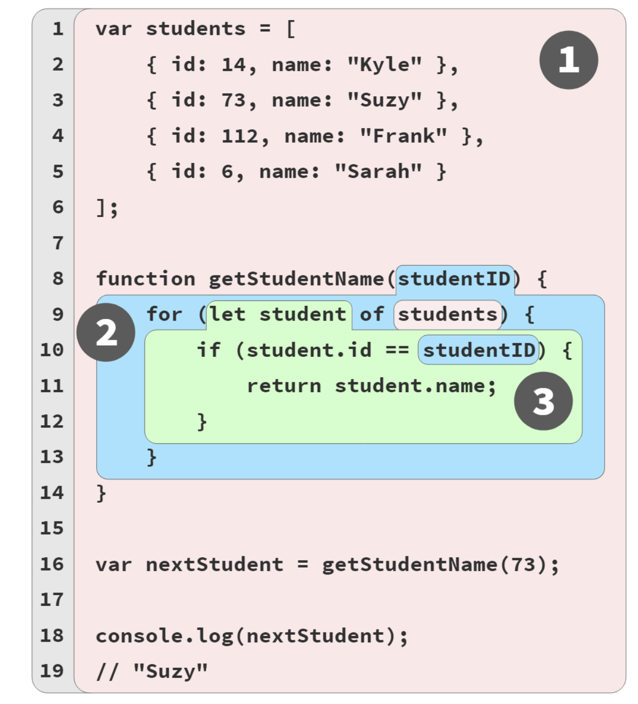

## You Don’t Know JS Yet: Scope & Closures


### Chapter 2: Illustrating Lexical Scope

>The term “lexical” refers to the first stage of compilation (lexing/parsing).

***

 **Marbles, and Buckets, and Bubbles... Oh My!**
 - **Scope** is sorting colored marbles into buckets of their matching color.
 - Imagine you come across a pile of marbles, and notice that all the marbles are colored red, blue, or green. Let’s sort all the marbles, dropping the red ones into a red bucket, green into a green bucket, and blue into a blue bucket. After sorting, when you later need a green marble, you already know the green bucket is where to go to get it.
 - The marbles are the *variables* in our program. 
 - The buckets are *scopes* (functions and blocks), which we just conceptually assign individual colors. 
 - The color of each marble is thus determined by which color *scope* we find the marble originally created in.
   ```ruby
   // outer/global scope: RED
    var students = [
                    { id: 14, name: "Kyle" }, 
                    { id: 73, name: "Suzy" }, 
                    { id: 112, name: "Frank" }, 
                    { id: 6, name: "Sarah" }
                  ];

    function getStudentName(studentID) {
            // function scope: BLUE
            for (let student of students) { 
                // loop scope: GREEN
                if (student.id == studentID) { 
                    return student.name;
                } 
            }
        }

    var nextStudent = getStudentName(73); 
    console.log(nextStudent); // Suzy    
   ```
  
   
    1. Bubble 1 (RED) encompasses the global scope, which holds three identifiers/variables: **students** (line 1), **getStudentName** (line 8), and **nextStudent** (line 16).
    2. Bubble 2 (BLUE) encompasses the scope of the function getStudentName(..) (line 8), which holds just one identifier/variable: the parameter **studentID** (line 8).
    3. Bubble 3 (GREEN) encompasses the scope of the for- loop (line 9), which holds just one identifier/variable: **student** (line 9).
   
>As the JS engine processes a program (during compilation), and finds a declaration for a variable, it essentially asks, “Which color scope (bubble or bucket) am I currently in?” The variable is designated as that same color, meaning it belongs to that bucket/bubble.

- An expression in the RED(1) bucket only has access to RED(1) marbles, not BLUE(2) or GREEN(3). An expression in the BLUE(2) bucket can reference either BLUE(2) or RED(1) marbles, not GREEN(3). And an expression in the GREEN(3) bucket has access to RED(1), BLUE(2), and GREEN(3) marbles.

**Conclusions**
  - Variables are declared in specific scopes, which can be thought of as colored marbles from matching-color buckets.
  - Any variable **reference** that appears in the scope where it was declared, or appears in any deeper nested scopes, will be labeled a marble of that same color—unless an intervening scope “shadows” the variable declaration;
  - The determination of colored buckets, and the marbles they contain, happens during compilation. This infor- mation is used for variable (marble color) “lookups” during code execution.

***

 **A Conversation Among Friends**

 - The members of the JS engine that will have conversations as they process our program:
    - **Engine:** responsible for start-to-finish compilation and execution of our JavaScript program.
    - **Compiler:** one of Engine’s friends; handles all the dirty work of parsing and code-generation.
    - **Scope Manager:** another friend of Engine; collects and maintains a lookup list of all the declared variables/identifiers, and enforces a set of rules as to how these are accessible to currently executing code.
  - the var students = [ .. ] declaration and initialization-assignment parts.
  >In fact, JS treats two distinct operations, one which **Compiler** will handle during compilation, and the other which **Engine** will handle during execution.

  >The first thing Compiler will do with this program is perform lexing to break it down into tokens, which it will then parse into a tree (AST).

  - The steps **Compiler** will follow to handle that statement:
    1. Encountering var students, **Compiler** will ask Scope Manager to see if a variable named students already exists for that particular scope bucket. If so, **Compiler** would ignore this declaration and move on. Otherwise, **Compiler** will produce code that (at execution time) asks Scope Manager to create a new variable called students in that scope bucket. `Scope Manager creates that variable in that scope`
    2. **Compiler** then produces code for Engine to later execute, to handle the students = [ ] assignment. The code Engine runs will first ask Scope Manager if there is a variable called students accessible in the current scope bucket. If not, Engine keeps looking elsewhere. Once Engine finds a variable, it assigns the reference of the [ .. ] array to it.
   

***

 **Nested Scope**

 - The function scope for getStudentName(..) is nested inside the global scope. 
 - The block scope of the for-loop is similarly nested inside that function scope. 
 - Scopes can be lexically nested to any arbitrary depth as the program defines.
> Each scope gets its own Scope Manager instance each time that scope is executed (one or more times).
 - At the beginning of a scope, if any identifier came from a function declaration, that variable is automatically initial- ized to its associated function reference. 
 - if any identifier came from a var declaration (as opposed to let/const), that variable is automatically initialized to undefined so that it can be used;
 - In the for (let student of **students**) { statement, **students** is a source reference that must be looked up. But how will that lookup be handled, since the scope of the function will not find such an identifier?
>One of the key aspects of lexical scope is that any time an identifier reference cannot be found in the current scope, the next outer scope in the nesting is consulted; that process is repeated until an answer is found or there are no more scopes to consult.


**Lookup Failures**
- When Engine exhausts all lexically available scopes (moving outward) and still cannot resolve the lookup of an identifier, an **error** condition then exists. However, depending on the mode of the program (strict-mode or not) and the role of the variable (target vs. source), this **error** condition will be handled differently.
  - **Undefined Mess**
    - If the variable is a **source**, an unresolved identifier lookup is considered an undeclared (unknown, missing) variable, which always results in a _ReferenceError_ being thrown.
    - If the variable is a **target**, and the code at that moment is running in strict-mode, the variable is considered undeclared and similarly throws a _ReferenceError_.
    `“Reference Error: XYZ is not defined.”`
    - **“Not defined”** really means **“not declared”**—or, rather, **“undeclared”** as in a variable that has no matching formal declaration in any lexically available scope.
    - **“undefined”** really means a variable was found (declared), but the variable otherwise has no other value in it at the moment, so it defaults to the **undefined** value.

  - **Global... What!?**
      - If the variable is a target and strict-mode is not in effect, a confusing and surprising legacy behavior kicks in. The troublesome outcome is that the global scope’s Scope Manager will just create an accidental global variable to fulfill that target assignment!
        ```ruby
          function getStudentName() {
            // assignment to an undeclared variable
            nextStudent = "Suzy";
          }

          getStudentName();

          console.log(nextStudent);
          // "Suzy" -- oops, an accidental-global variable!

        ```
        >Always use strict- mode, and always formally declare your variables. You’ll then get a helpful **ReferenceError** if you ever mistakenly try to assign to a not-declared variable.
        

_The End_
