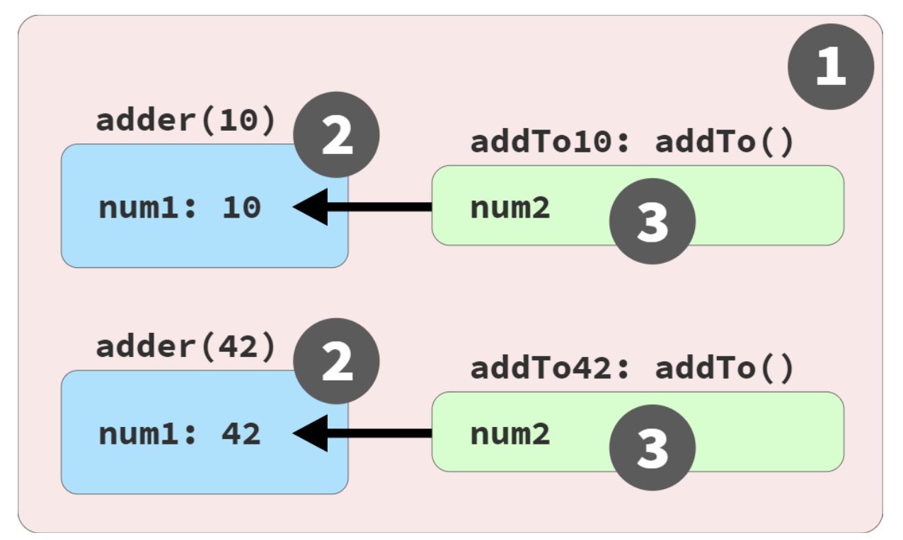
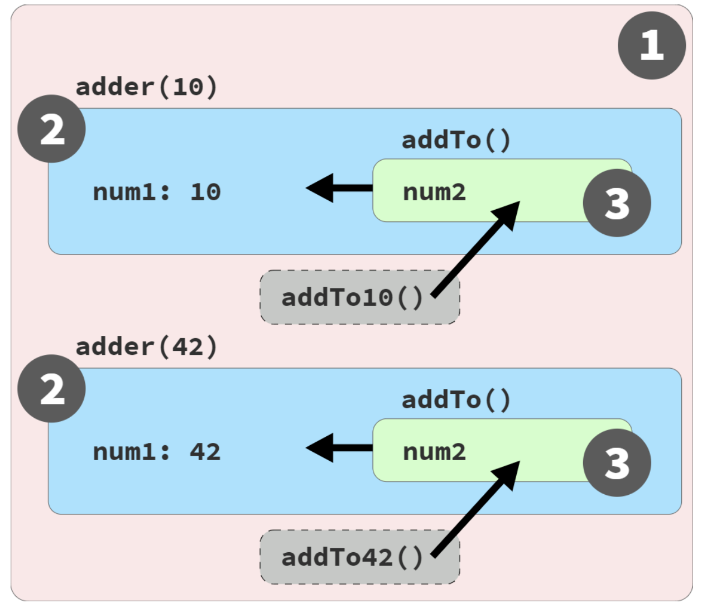

## You Don’t Know JS Yet: Scope & Closures


### Chapter 7:Using Closures

- The least exposure principle (POLE) encourages us to use block (and function) scoping to limit the scope exposure of variables. This helps keep code understandable and maintainable, and helps avoid many scoping pitfalls.
- Closure builds on this approach: for variables we need to use over time, instead of placing them in larger outer scopes, we can encapsulate (more narrowly scope) them but still preserve access from inside functions, for broader use. Functions remember these referenced scoped variables via closure.

***
  
  **See the Closure**

  >Closure is a behavior of functions and only functions. 
  >- **Only functions have closure.**

  - **Adding Up Closures**
    closure example:
    ```ruby
      function adder(num1) {
          return function addTo(num2){
                return num1 + num2;
              };
      }

      var add10To = adder(10);
      var add42To = adder(42); 

      add10To(15); // 25
      add42To(9);     // 51
    ```
    - closure is associated with an instance of a function, rather than its single lexical definition.
    - But actually, every time the outer **adder(..)** function runs, a new inner **addTo(..)** function instance is created, and for each new instance, a new *closure*. So each inner function instance (labeled add10To(..) and add42To(..) in our program) has its own closure over its own instance of the scope environment from that execution of **adder(..)**.
    > Even though closure is based on lexical scope, which is handled at compile time, closure is observed as a runtime characteristic of function instances.

  - **Live Link, Not a Snapshot**
     - Closure is actually a live link, preserving access to the full variable itself. 
     - The closed-over variable can be updated (re-assigned).
     - By closing over a variable in a function, we can keep using that variable (read and write) as long as that function reference exists in the program, and from anywhere we want to invoke that function. 
     - The function instances and scope links:
       
  
  - **Common Closures: Ajax and Events**
      Closure is most commonly encountered with callbacks:
      ```ruby
      function lookupStudentRecord(studentID) { 
        ajax(
          `https://some.api/student/${ studentID }`, 
              function onRecord(record) {
                  console.log(`${ record.name } (${ studentID })`); 
              }
        ); 
      }
      lookupStudentRecord(114);
      // Frank (114)
      ```

  - **Definition of Closure** is observed when a function uses variable(s) from outer scope(s) even while running in a scope where those variable(s) wouldn’t be accessible.
  - The key parts of this definition are:
      - Must be a function involved
      - Must reference at least one variable from an outer scope
      - Must be invoked in a different branch of the scope chain from the variable(s)

***

  **The Closure Lifecycle and Garbage Collection (GC)**

  - Since closure is inherently tied to a function instance, its closure over a variable lasts as long as there is still a reference to that function.
  - When considering the overall health and efficiency of the program, unsubscribing an event handler when it’s no longer needed can be even more important than the initial subscription!
  - closure must be per scope, implementation wise, and then an optional optimization trims down the scope to only what was closed over (a similar outcome as per variable closure).
  - In cases where a variable holds a large value (like an object or array) and that variable is present in a closure scope, if you don’t need that value anymore and don’t want that memory held, it’s safer (memory usage) to manually discard the value rather than relying on closure optimization/GC.
   > In many cases JS might automatically optimize the program to the same effect. But it’s still a good habit to be careful and explicitly make sure we don’t keep any significant amount of device memory tied up any longer than necessary.
  - It’s important to know where closures appear in our programs, and what variables are included. We should manage these closures carefully so we’re only holding onto what’s minimally needed and not wasting memory.

***

  **An Alternative Perspective**
 
  - Code example:
    ```ruby
      // outer/global scope: RED(1)

      function adder(num1) {
          // function scope: BLUE(2)
                return function addTo(num2){ 
                  // function scope: GREEN(3)
          return num1 + num2; 
        };
    } 

    var add10To = adder(10); 
    var add42To = adder(42);

    add10To(15);    // 25
    add42To(9);     // 51

    ``` 
  - Our **current** perspective suggests that wherever a function is passed and invoked, closure preserves a hidden link back to the original scope to facilitate the access to the closed-over variables.
      
  - This alternative model de-emphasizes “functions as first-class values,” and instead embraces how functions (like all non- primitive values) are held by reference in JS, and assigned/passed by reference-copy.
  - In this **alternative** model, functions stay in place and keep accessing their original scope chain just like they always could.
     
  - Closure instead describes the magic of keeping alive a function instance, along with its whole scope environment and chain, for as long as there’s at least one reference to that function instance floating around in any other part of the program.


***

  **Why Closure?**
  ```ruby
      // HTML 
      // <button data-kind="studentIDs">
      //    Register Students
      // </button>

      var APIendpoints = { studentIDs:
              "https://some.api/register-students",
              // ..
          };

      var data = {
            studentIDs: [ 14, 73, 112, 6 ], 
            // ..
          };

      //------------------
      //Without using closure:
      //------------------

      function makeRequest(evt) {
        var btn = evt.target;
        var recordKind = btn.dataset.kind; 
        ajax(
             APIendpoints[recordKind],
            data[recordKind]
          );
      }
     
      btn.addEventListener("click",makeRequest);

      //------------------
      //Try using closure to improve the code:
      //------------------

        function setupButtonHandler(btn) {

            var recordKind = btn.dataset.kind;

            btn.addEventListener("click",
            function makeRequest(evt){
                        ajax(
                            APIendpoints[recordKind],
                            data[recordKind]
                        ); 
                        }); 
        }        

        setupButtonHandler(btn);


      //------------------
      // Building on this pattern, we could have looked up 
      // both the URL and data once, at setup:
      //------------------

       function setupButtonHandler(btn) {
              var recordKind = btn.dataset.kind;
              var requestURL = APIendpoints[recordKind]; 
              var requestData = data[recordKind];

              btn.addEventListener("click",
                     function makeRequest(evt){ 
                            ajax(requestURL,requestData);
                        } );
              }

       // Now makeRequest(..) is closed over requestURL and requestData, 
       // which is a little bit cleaner to understand, 
       // and also slightly more performant.
   
  ```
  - Two similar techniques from the Functional Programming (FP) paradigm that rely on closure are partial application and currying. 
  - These techniques, we alter the shape of functions that require multiple inputs so some inputs are provided up front, and other inputs are provided later; the initial inputs are remembered via closure. 
  - Once all inputs have been provided, the underlying action is performed.
  - By creating a function instance that encapsulates some information inside (via closure), the function-with-stored-information can later be used directly without needing to reprovide that input.
  > This makes that part of the code cleaner, and also offers the opportunity to label partially applied functions with better semantic names.
  - Adapting partial application, we can further improve the preceding code:
    ```ruby
      function defineHandler(requestURL,requestData) { 
            return function makeRequest(evt){
              ajax(requestURL,requestData);
          };
      }

      function setupButtonHandler(btn) { 
        var recordKind = btn.dataset.kind; 
        var handler = defineHandler(
              APIendpoints[recordKind],
              data[recordKind]
          );
          btn.addEventListener("click",handler);
      }
    ```
***

  **Closer to Closure**
- There are two models for mentally tackling closure:
   -  **Observational**: closure is a function instance remembering its outer variables even as that function is passed to and invoked in other scopes.
   -  **Implementational**: closure is a function instance and its scope environment preserved in-place while any references to it are passed around and invoked from other scopes.
- The benefits to our programs:
  - Closure can improve efficiency by allowing a function instance to remember previously determined information instead of having to compute it each time.
  -  Closure can improve code *readability*, bounding scope-exposure by encapsulating variable(s) inside function instances, while still making sure the information in those variables is accessible for future use. The resultant narrower, more specialized function instances are cleaner to interact with, since the preserved information doesn’t need to be passed in every invocation.
***


